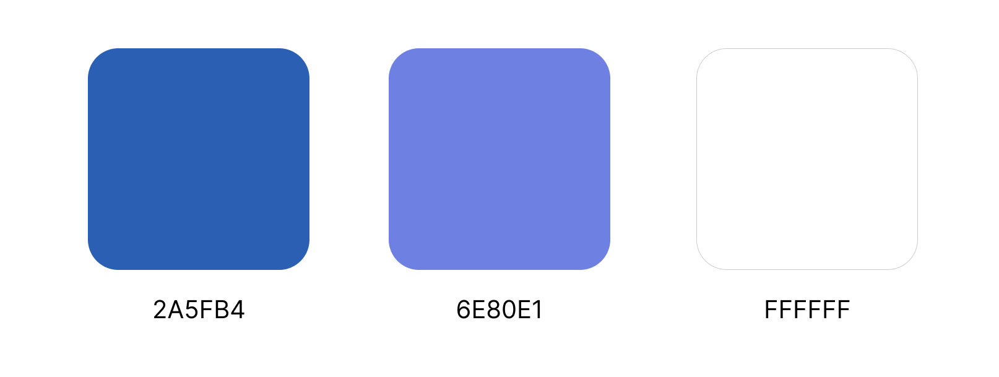

### 4.1.1. General Style Guidelines.
#### Branding
El logo estará creado a partir de una caja, que representa los inventarios; y un relámpago, que simboliza los aparatos electrónicos. El logo cuenta con 2 variantes, una para fondos oscuros y la otra para fondos claros.

#### Typography
La tipografía que se utilizará será “Montserrat” y sus variantes: Bold, Medium y regular. El tamaño de la fuente variará entre 1rem (texto normal), 2rem (subtítulos) y 3rem  (títulos o encabezados).

#### Colors
El color principal será un tono azul (#2A5FB4) y como secundarios al blanco (#FFFFFF) y un tono azul más claro (#6E80E1)

#### Spacing
- Botones: padding 1,5rem vertical y 2rem vertical
- Texto: 1rem
- Elementos: 1,5rem
- Secciones: 5rem

#### Dimension:
La propuesta de diseño se basará en un lenguaje sereno, formal y respetuoso. Por este motivo, se eligió al color azul ya que este representa confianza y profesionalismo. Esta propuesta debe transmitir confianza a los usuarios al depositar sus datos de valor en nuestra aplicación.
