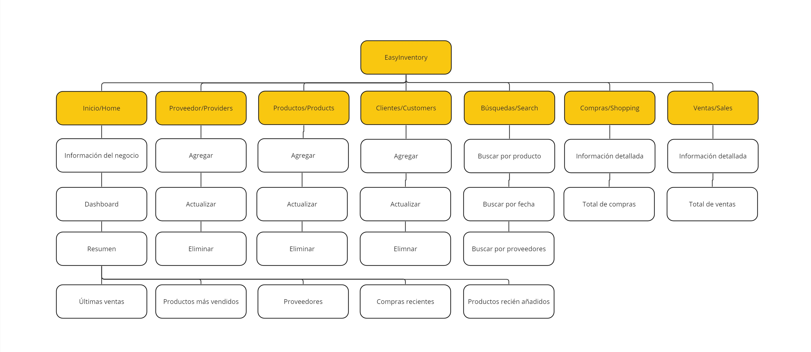

### 4.2.1. Organization Systems.
Para la organización visual, se ordenará el contenido de forma jerárquica (visual hierarchy).
Además, se empleará categorización por tópicos, ya que contamos con 7 categorías específicas: Home, proveedores,
productos, clientes, búsquedas, compras y ventas. Cada una de estas categorías tendrá su propio menú de navegación.
