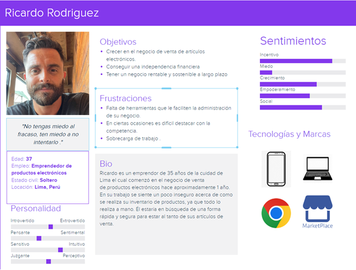
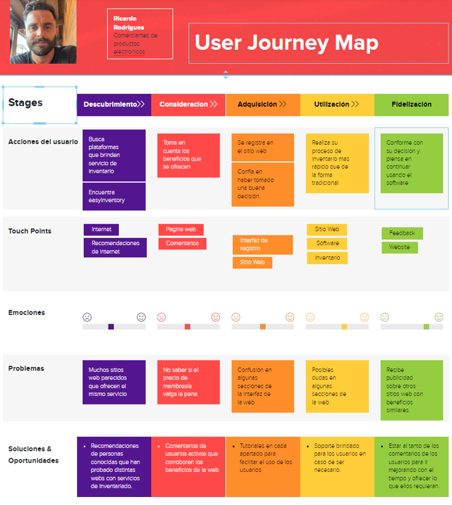
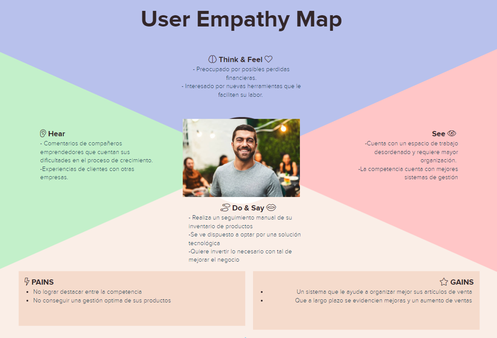

# Universidad Peruana De Ciencas Aplicadas
## Aplicaciones Web SW52

## "Informe de Trabajo Final"
## ArtSoft - EasyInventory
##  Profesor: Angel Augusto Velasquez Nuñez
## Integrantes:
* ### Vega Sayritupac Paul Kennedin u20201b333
* ### Morales Quispe Brayan Smith   u20211f984      
* ### Miranda Sinarahua Piero       u20181g752     
* ### Taype Fernandez Leonardo      u20201e840
* ### Becerra Llempen Fabiola Dayane u20171a518
-----
## Registro de Versiones Del Informe

| Version | Fecha | Autor |   Descripcion de modificacion   |
|----------|----------|----------|----------|
| Row 1    | Cell 2   | Cell 3   | Cell 3   |

## Project Report Collaboration Insights 

------
## Contenido 
#### Capitulo I: Introducción
#### 1.1. Startup Profile
#### 1.1.1. Descripcion de la Startup
#### 1.1.2. Perfiles de Integrantes del equipo
#### 1.2. Solution Profile
#### 1.2.1. Antecedentes y problematica
#### 1.2.2. Lean UX Process 
#### 1.2.2.1. Lean UX Problem Statements
#### 1.2.2.2. Lean UX Assumptions
#### 1.2.2.3. Lean UX Hypothesis Statements
#### 1.2.2.4. Lean UX Canvas
#### 1.3. Segmentos Objetivos
#### Capitulo II: Requirements Elicitation & Analysis
#### 2.1. Competidores
#### 2.1.1. Analisis Competitivo
#### 2.1.2. Estrategias y tacticas frente a competidores
#### 2.2. Entrevistas  
#### 2.2.1. Diseño de entrevistas
#### 2.2.2. Registro de entrevistas
#### 2.2.3. Analisis de entrevistas 
#### 2.3. Needfinding
#### 2.3.1. User Personas  
#### 2.3.2. User Task Matrix
#### 2.3.3. User Journey Mapping
#### 2.3.4. Empathy Mapping
#### 2.3.5. As-is Scenario Mapping
#### Capitulo III: Requirements Specification
#### 3.1. To-Be Scenario Mapping.
#### 3.2. User Stories 
#### 3.3. Impact Mapping
#### 3.4. Product Backlog
#### Capitulo IV: Product  Design
#### 4.1. Style Guidelines 
#### 4.1.1 General Style Guidelines 
#### 4.1.2. Web Style Guidelines
#### 4.2. Information Architecture
#### 4.2.1. Organization Systems
#### 4.2.2. Labeling Systems
#### 4.2.3. SEO Tags and Meta Tags
#### 4.2.4. Searching Systems
#### 4.2.5. Navigation Systems
#### 4.3. Landing Page UI Design
#### 4.3.1. Landing Page Wireframe
#### 4.3.2. Landing Page Mock-up
#### 4.4. Web Applications UX/UI Desing
#### 4.4.1. Web Application Wireframes
#### 4.4.2. Web Application Wireflow Diagrams
#### 4.4.3. Web Application Mock-ups
#### 4.4.4. Web Application User Flow Diagrams
#### 4.5. Web Applications Prototyping
#### 4.6. Domain-Drive Software Architecture
#### 4.6.1 Software Architecture Context Diagram
#### 4.6.2. Software Architecture Container Diagrams
#### 4.6.3. Software Architecture Components Diagrams
#### 4.7. Software Object-Oriented Design
#### 4.7.1 Class Diagrams
#### 4.7.2. Class Dictionary
#### 4.8. Database Design
#### 4.8.1. Databse Diagram
#### Capitulo V: Product Implementation, Validation & Deployment
#### 5.1. Software Configuration Management
#### 5.1.1. Software Development Environment Configuration
#### 5.1.2. Source Code Management 
#### 5.1.3. Source Code Style Guide & Conventions
#### 5.1.4. Software Deployment Configuration
#### 5.2 Landing Page, Services & Applications Implementation
#### 5.2.1. Sprint 1
#### 5.2.1.1. Sprint Planning 1
#### 5.2.1.2. Sprint Backlog 1 
#### 5.2.1.3. Development Evidence for Sprint Review
#### 5.2.1.4. Testing Suite Evidence for Sprint Review
#### 5.2.1.5. Execution Evidence for Sprint Review
#### 5.2.1.6. Services Documentation Evidence for Sprint Review
#### 5.2.1.7. Software Deployment Evidence for Sprint Review
#### 5.2.1.8. Team Collaboration Insights during Sprint

-----
## Student Outcome

| Criterio Especifico | Acciones Realizadas | Conclusiones | 
|----------|----------|----------|
| Row 1    | Cell 2   | Cell 3   | 
-----

## 2.3 Needfinding 
##### Luego de identificar cual será nuestro segmento objetivo, hemos realizado entrevistas con las cuales recolectamos información como cualidades y necesidades para nuestro segmento. Estos datos nos ayudaran durante el diseño y desarrollo de nuestro sitio web. Para ello, utilizaremos herramientas como el User Persona, User Task Matrix, User Journey Map, Empathy Map y As Is Scenario Map. Estas herramientas nos permitirán sintetizar toda la información recolectada. 

### 2.3.1 User Persona
##### El User Persona usa información en base a lo obtenido en las entrevistas realizadas. Nuestro tipo de usuario vendría siendo un comerciante de productos electrónicos, para el cual se encontraron las siguientes características:
* ##### El usuario requiere una herramienta que le facilite la gestión y administración de su negocio
* ##### El usuario está dispuesto a adaptarse a nuevas tecnologías y formas de mejorar el negocio.
* ##### El usuario quiere que su negocio crezca y es conciente de lo que se requiere para conseguirlo

### 2.3.2 User Task Matrix
##### El segmento que se está considerando es el de las empresas relacionadas con la venta de componentes electrónicos:

| Task Matrix |Emprendedor |
|-------------|------------|
| |Frecuencia / Importancia| 
| Analiza la competencia y busque la forma de destacar entre ellos| Always /  High |
| Llamar la atención del público en distintas redes | Usually / Medium |
| Buscar una manera de mejorar los procesos y la gestión de sus productos | Always / High |
| Establecer metas de ventas en un periodo de tiempo | Often / Medium |
| Ofrecer productos a mejor precio que la competencia | Usually / Medium | 

###### Las tareas que más frecuencia tienen para nuestro segmento objetivo son las de “Analizar la competencia y buscar la forma de destacar entre ellos” y “Buscar la manera de mejorar los procesos y gestión de sus productos”. Esto se debe a que el usuario estaría más al pendiente de como ofrecer mejores beneficios que la competencia y de cómo sus procesos de gestión ayudarían de cierta manera a conseguir este objetivo. 
### 2.3.3 User Journey Mapping 
##### En esta sección se ilustrará la experiencia que tendría el usuario a lo largo del proceso de vinculación con nuestra página web y la solución que se le estaría brindando en relación a su problema con el inventario de productos de su negocio. 

### 2.3.4 User Empathy Map

