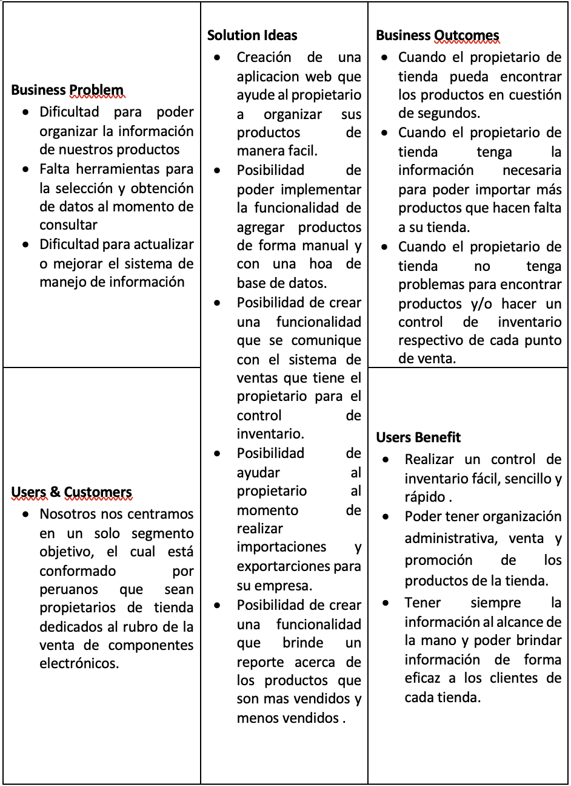
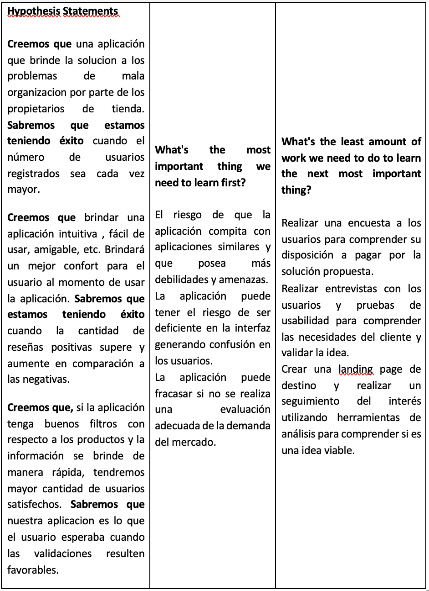

# Universidad Peruana De Ciencas Aplicadas
## Aplicaciones Web SW52

## "Informe de Trabajo Final"
## ArtSoft - EasyInventory
##  Profesor: Angel Augusto Velasquez Nuñez
## Integrantes:
* ### Vega Sayritupac Paul Kennedin u20201b333
* ### Morales Quispe Brayan Smith   u20211f984      
* ### Miranda Sinarahua Piero       u20181g752     
* ### Taype Fernandez Leonardo      u20201e840
* ### Becerra Llempen Fabiola Dayane u20171a518
-----
## Registro de Versiones Del Informe

| Version | Fecha | Autor |   Descripcion de modificacion   |
|----------|----------|----------|----------|
| Row 1    | Cell 2   | Cell 3   | Cell 3   |

## Project Report Collaboration Insights 

------
## Contenido 
#### Capitulo I: Introducción
#### 1.1. Startup Profile
#### 1.1.1. Descripcion de la Startup
#### 1.1.2. Perfiles de Integrantes del equipo
#### 1.2. Solution Profile
#### 1.2.1. Antecedentes y problematica
#### 1.2.2. Lean UX Process 
#### 1.2.2.1. Lean UX Problem Statements
#### 1.2.2.2. Lean UX Assumptions
#### 1.2.2.3. Lean UX Hypothesis Statements
#### 1.2.2.4. Lean UX Canvas
#### 1.3. Segmentos Objetivos
#### Capitulo II: Requirements Elicitation & Analysis
#### 2.1. Competidores
#### 2.1.1. Analisis Competitivo
#### 2.1.2. Estrategias y tacticas frente a competidores
#### 2.2. Entrevistas  
#### 2.2.1. Diseño de entrevistas
#### 2.2.2. Registro de entrevistas
#### 2.2.3. Analisis de entrevistas 
#### 2.3. Needfinding
#### 2.3.1. User Personas  
#### 2.3.2. User Task Matrix
#### 2.3.3. User Journey Mapping
#### 2.3.4. Empathy Mapping
#### 2.3.5. As-is Scenario Mapping
#### Capitulo III: Requirements Specification
#### 3.1. To-Be Scenario Mapping.
#### 3.2. User Stories 
#### 3.3. Impact Mapping
#### 3.4. Product Backlog
#### Capitulo IV: Product  Design
#### 4.1. Style Guidelines 
#### 4.1.1 General Style Guidelines 
#### 4.1.2. Web Style Guidelines
#### 4.2. Information Architecture
#### 4.2.1. Organization Systems
#### 4.2.2. Labeling Systems
#### 4.2.3. SEO Tags and Meta Tags
#### 4.2.4. Searching Systems
#### 4.2.5. Navigation Systems
#### 4.3. Landing Page UI Design
#### 4.3.1. Landing Page Wireframe
#### 4.3.2. Landing Page Mock-up
#### 4.4. Web Applications UX/UI Desing
#### 4.4.1. Web Application Wireframes
#### 4.4.2. Web Application Wireflow Diagrams
#### 4.4.3. Web Application Mock-ups
#### 4.4.4. Web Application User Flow Diagrams
#### 4.5. Web Applications Prototyping
#### 4.6. Domain-Drive Software Architecture
#### 4.6.1 Software Architecture Context Diagram
#### 4.6.2. Software Architecture Container Diagrams
#### 4.6.3. Software Architecture Components Diagrams
#### 4.7. Software Object-Oriented Design
#### 4.7.1 Class Diagrams
#### 4.7.2. Class Dictionary
#### 4.8. Database Design
#### 4.8.1. Databse Diagram
#### Capitulo V: Product Implementation, Validation & Deployment
#### 5.1. Software Configuration Management
#### 5.1.1. Software Development Environment Configuration
#### 5.1.2. Source Code Management 
#### 5.1.3. Source Code Style Guide & Conventions
#### 5.1.4. Software Deployment Configuration
#### 5.2 Landing Page, Services & Applications Implementation
#### 5.2.1. Sprint 1
#### 5.2.1.1. Sprint Planning 1
#### 5.2.1.2. Sprint Backlog 1 
#### 5.2.1.3. Development Evidence for Sprint Review
#### 5.2.1.4. Testing Suite Evidence for Sprint Review
#### 5.2.1.5. Execution Evidence for Sprint Review
#### 5.2.1.6. Services Documentation Evidence for Sprint Review
#### 5.2.1.7. Software Deployment Evidence for Sprint Review
#### 5.2.1.8. Team Collaboration Insights during Sprint

-----
## Student Outcome

| Criterio Especifico | Acciones Realizadas | Conclusiones | 
|----------|----------|----------|
| Row 1    | Cell 2   | Cell 3   | 
-----
## CAPITULO 1: INTRODUCCION
### 1.1. Startup Profile
####  1.1.1. Descripción de la Startup
##### ArtSoft es una startup que nació de la necesidad de solucionar el problema de empresas emergentes que se encuentren en el rubro electronico, los cuales no cuentan con un sistema adecuado para poder manejar el inventario de sus productos. De esta forma nació EasyInventory, una aplicación web dirigida a estas tiendas. 
##### Esta aplicación web brindará una solución  a los problemas que los propietarios presenten con la organización del inventario de cada punto de venta, problemas como la mala gestión de los productos de cada punto, actualizar los productos, introducir nuevos productos, entre otro. Asimismo, podremos presentarle una interfaz sencilla, amigable y facil de usar en la que cualquier propietario de tienda podrá entender y utilizar.
##### EasyInventory una aplicación web que mejora la organizació de productos, inventario del propietario de tienda, como startup podremos  brindar la mejor experiencia de usuario para cada opción que la aplicación presente .
#### 1.1.2. Perfiles de Los Integrantes del Equipo

| Integrante | Descripción | 
|----------|----------|
| Paul Kennedin Vega Sayritupac    |Hola mi nombre es Paul Vega, soy estudiante de la carrera de Ingeniería de Software mis hobbies son jugar videojuegos, escuchar música y cocinar. Asimismo, los valores que poseo son responsabilidad, solidaridad, empatía y convicción. Tengo toda la pasión y el esfuerzo para realizar este trabajo junto a mis compañeros para poder ser profesionales capacitados y poder estar bien preparados en el ámbito laboral.   |
| CEL 2 | CEL 2|
| CEL 2 | CEL 2|
| CEL 2 | CEL 2|
| CEL 2 | CEL 2|
### 1.2. Solution Profile
#### 1.2.1. Antecedentes y Problematica
##### What?
##### Muchos propietarios no cuentan con el sistema adecuado para poder manejar su tienda, ocasionando una mala organizació en su empresa ..
##### When?
##### En cada recuento de productos que hacen, mayormente estos datos son inmensos y se debe de tratar con mucho cuidao.
##### Where?
##### En lima metropolitana, cada propietario de tienda dedicado al rubro de la venta de componentes electronicos.
##### Why?
##### Debido a la falta de una herramienta los propietarios optan por utilizar los recursos que tienen a la mano como : hojas de calculo, donde ingresen todos los productos.
##### Who?
##### Propietarios de tienda dedicados a la venta de componentes electronicos que busquen la forma sencilla de manejar la información de su empresa.
##### How?
##### Creemos que un producto digital, el cual brinde herramientas para facilitar el manejo de información resolverá este problema de la organización.
##### How Much?
##### Segun encuestas realizadas, un gran porcentaje de personas dentro de cada mype realiza un control de inventario, esto quiere decir la gestión de productos siempre sera requeria en cada empresa.
#### 1.2.2. Lean UX Process 
#### 1.2.2.1. Lean UX Problem Statements
##### Hemos observado que muchos propietarios de tienda tienen dificultades a la hora de manejar la información de su empresa. Además, de que estos mismo al estar emergiendo o ser una mype, no cuentan con la información suficiente.
#### 1.2.2.2. Lean UX Assumptions
##### **Business Assumptions** 
##### a) Creemos que nuestros usuarios necesitan una aplicación sencilla de utilizar y eficiente
##### b) Esta necesidad puede resolverse mediante la herramienta de control de inventario 
##### c) Nuestros usuarios iniciales serán propietarios de tienda que se encuentren en el rubro de electronica
##### d) Lo didáctico que puede llegar a ser un control de inventario
##### e) Obtendremos la mayoría de nuestro clientes mediante publicidad y derivaciones en redes sociales y una buena red de contactos que se encuentren en el mismo rubro
##### f) Generaremos ingresos a través de de herramientas adicionales para usuarios con una suscripción superior a la basica
##### g) Nuestro mayor riesgo sera la interfaz, que sea una interfaz acorde a nuestro segmento, dónde el cliente pueda decidir si tiene un diseño agradable
##### h) Lo resolveremos con pruebas de validación por parte de nuestro segmento objetivo
##### **User Assuptions**  
##### **Who is the user** 
##### Peruanos propietarios del comercio electronico.
##### **Where does our product fit in their work or life?**  
##### Nuestro producto encaja en el trabajo de nuestros usuarios
##### **What problems does our product solve?**  
##### El problema de una organización inadecuada por parte de nuestro usuarios con sus puntos de venta o tiendas.
##### **When and how is our product used?**  
##### Siempre que nuestros usuarios quieran hacer un control de inventario.
##### **What feature are important?**  
##### La herramienta de agregar productos, modificar, eliminar y poder descargar un informe detallado de cada inventario del usuario.
##### **How should our product look and behave?**  
##### Debe verse amigable, eficaz y sencillo de usar para que la herramienta se tenga que adecuar al usuario.
#### 1.2.2.3. Lean UX Hypothesis Statements
##### **Creemos que** una aplicación que brinde la solucion a los problemas de mala organizacion por parte de los propietarios de tienda. **Sabremos que estamos teniendo éxito cuando** el número de usuarios registrados sea cada vez mayor.
##### **Creemos que brindar una aplicación intuitiva , fácil de usar, amigable, etc. Brindará un mejor confort para el usuario al momento de usar la aplicación. **Sabremos que estamos teniendo éxito** cuando la cantidad de reseñas positivas supere y aumente en comparación a las negativas.
##### **Creemos que**, si la aplicación tenga buenos filtros con respecto a los productos y la información se brinde de manera rápida, tendremos mayor cantidad de usuarios satisfechos. **Sabremos que nuestra aplicacion** es lo que el usuario esperaba cuando las validaciones resulten favorables.
#### 1.2.2.4. Lean UX Canvas

##### El Lean UX Canvas es una herramienta visual que se utiliza en la metodología Lean UX para definir la estrategia y el enfoque de diseño del producto o servicio. Esta herramienta se basa en el Modelo de Negocio Canvas y se enfoca en el usuario y en la eficiencia del proceso, en lugar de en la planificación exhaustiva y detallada de la experiencia del usuario.

### 1.3. Segmento Objetivo
##### Nosotros nos centramos en un solo segmento objetivo, el cual está conformado por peruanos que sean propietarios de tienda dedicados al rubro de la venta de componentes electrónicos.