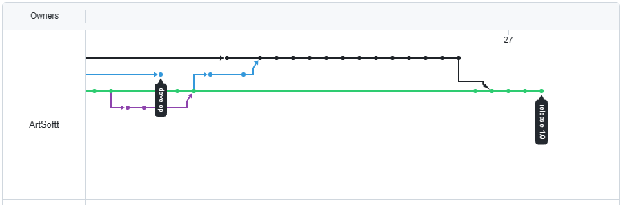

# Universidad Peruana De Ciencas Aplicadas

## Aplicaciones Web SW52

## "Informe de Trabajo Final"

## ArtSoft - EasyInventory

## Profesor: Angel Augusto Velasquez Nuñez

## Integrantes:

* ### Vega Sayritupac Paul Kennedin u20201b333
* ### Morales Quispe Brayan Smith   u20211f984
* ### Miranda Sinarahua Piero       u20181g752
* ### Taype Fernandez Leonardo      u20201e840

-----

## Registro de Versiones Del Informe

| Version | Fecha    | Autor                                                             | Descripcion de modificacion                          |
|---------|----------|-------------------------------------------------------------------|------------------------------------------------------|
| 0.1     | 14/09/23 | Paul                                                              | Desarrollo del capitulo I                            |  
| 0.1     | 14/09/23 | Fabiola                                                           | Desarrollo del capitulo II                           |
| 0.1     | 14/09/23 | Piero                                                             | Desarrollo del capitulo II y  III                    |
| 0.2     | 18/09/23 | Brayan Smith                                                      | Reorganizacion del documento                         |
| 0.3     | 22/09/23 | Piero Miranda                                                     | Correcciones en el capitulo I                        |
| 1       | 22/09/23 | * Piero Miranda * Brayan Smith   * Fabiola   * Paul   | Sprint 2                                             |
| 1.5     | 22/10/23 | Brayan Smith                                                      | Sprint 3-sprint planing                              |
| 1.6     | 23/10/23 | Paul Kennedin                                                     | Sprint 3-product backload                            |
| 1.9     | 24/10/23 | leonardo                                                          | agregar las entrevistas y validaciones               |
| 2.0     | 28/10/23 | Paul Kennedin                                                     | agregar las evidencias del despliege                 |
| 2.1     | 20/11/23 | Leonardo                                                          | Arreglo de los diagramas de clases y base de datos   |
| 2.2     | 20/11/23 | Brayan                                                            | Arreglo del 4.6. Domain-Driven Software Architecture |
| 2.3     | 20/11/23 | Paul Kennedin                                                     | Arreglo del sprint 1                                 |
| 2.4     | 20/11/23 | Brayan Smith                                                      | Arreglo del sprint 2                                 |
| 2.5     | 20/11/23 | Brayan Smith                                                      | Arreglo del capitulo 5                               |

## Project Report Collaboration Insights

__1) Agosto 12, 2023 - Noviembre 1,2023__

Actualizacion en este punto del proyecto perdimos dos miembros Piero y Fabiola siendo sus commits estaran pausados en
cambio los demas miembros que quedan, estos aumentaron sus commits respecto anteriores entregas

Link del repositorio:[https://github.com/orgs/ArtSoftt/repositories](https://github.com/orgs/ArtSoftt/repositories)

------

## Contenido

#### Capitulo I: Introducción

- [1.1. Startup Profile](#11-startup-profile)
    - [1.1.1. Descripción de la Startup](#111-descripción-de-la-startup)
    - [1.1.2. Perfiles de Integrantes del equipo](#112-perfiles-de-integrantes-del-equipo)
- [1.2. Solution Profile](#12-solution-profile)
    - [1.2.1. Antecedentes y problematica](#121-antecedentes-y-problematica)
    - [1.2.2. Lean UX Process](#122-lean-ux-process)
        - [1.2.2.1. Lean UX Problem Statements](#1221-lean-ux-problem-statements)
        - [1.2.2.2. Lean UX Assumptions](#1222-lean-ux-assumptions)
        - [1.2.2.3. Lean UX Hypothesis Statements](#1223-lean-ux-hypothesis-statements)
        - [1.2.2.4. Lean UX Canvas](#1224-lean-ux-canvas)
- [1.3. Segmentos Objetivos](#13-segmentos-objetivos)

#### Capitulo II: Requirements Elicitation & Analysis

- [2.1. Competidores](#21-competidores)
    - [2.1.1. Análisis Competitivo](#211-análisis-competitivo)
    - [2.1.2. Estrategias y Tácticas Frente a Competidores](#212-estrategias-y-tácticas-frente-a-competidores)
- [2.2. Entrevistas](#22-entrevistas)
    - [2.2.1. Diseño de Entrevistas](#221-diseño-de-entrevistas)
    - [2.2.2. Registro de Entrevistas](#222-registro-de-entrevistas)
    - [2.2.3. Análisis de Entrevistas](#223-análisis-de-entrevistas)
- [2.3. Needfinding](#23-needfinding)
    - [2.3.1. User Personas](#231-user-personas)
    - [2.3.2. User Task Matrix](#232-user-task-matrix)
    - [2.3.3. User Journey Mapping](#233-user-journey-mapping)
    - [2.3.4. Empathy Mapping](#234-empathy-mapping)
    - [2.3.5. As-is Scenario Mapping](#235-as-is-scenario-mapping)

#### Capitulo III: Requirements Specification

- [3.1. To-Be Scenario Mapping](#31-to-be-scenario-mapping)
- [3.2. User Stories](#32-user-stories)
- [3.3. Impact Mapping](#33-impact-mapping)
- [3.4. Product Backlog](#34-product-backlog)

#### Capitulo IV: Product  Design

- [4.1. Style Guidelines](#41-style-guidelines)
    - [4.1.1. General Style Guidelines](#411-general-style-guidelines)
    - [4.1.2. Web Style Guidelines](#412-web-style-guidelines)
- [4.2. Information Architecture](#42-information-architecture)
    - [4.2.1. Organization Systems](#421-organization-systems)
    - [4.2.2. Labeling Systems](#422-labeling-systems)
    - [4.2.3. SEO Tags and Meta Tags](#423-seo-tags-and-meta-tags)
    - [4.2.4. Searching Systems](#424-searching-systems)
    - [4.2.5. Navigation Systems](#425-navigation-systems)
- [4.3. Landing Page UI Design](#43-landing-page-ui-design)
    - [4.3.1. Landing Page Wireframe](#431-landing-page-wireframe)
    - [4.3.2. Landing Page Mock-up](#432-landing-page-mock-up)
- [4.4. Web Applications UX/UI Design](#44-web-applications-uxui-design)
    - [4.4.1. Web Application Wireframes](#441-web-application-wireframes)
    - [4.4.2. Web Application Wireflow Diagrams](#442-web-application-wireflow-diagrams)
    - [4.4.3. Web Application Mock-ups](#443-web-application-mock-ups)
    - [4.4.4. Web Application User Flow Diagrams](#444-web-application-user-flow-diagrams)
- [4.5. Web Applications Prototyping](#45-web-applications-prototyping)
- [4.6. Domain-Driven Software Architecture](#46-domain-driven-software-architecture)
    - [4.6.1. Software Architecture Context Diagram](#461-software-architecture-context-diagram)
    - [4.6.2. Software Architecture Container Diagrams](#462-software-architecture-container-diagrams)
    - [4.6.3. Software Architecture Components Diagrams](#463-software-architecture-components-diagrams)
- [4.7. Software Object-Oriented Design](#47-software-object-oriented-design)
    - [4.7.1. Class Diagrams](#471-class-diagrams)
    - [4.7.2. Class Dictionary](#472-class-dictionary)
- [4.8. Database Design](#48-database-design)
    - [4.8.1. Database Diagram](#481-database-diagram)

#### Capitulo V: Product Implementation, Validation & Deployment

- [5.1. Software Configuration Management](#51-software-configuration-management)
    - [5.1.1. Software Development Environment Configuration](#511-software-development-environment-configuration)
    - [5.1.2. Source Code Management](#512-source-code-management)
    - [5.1.3. Source Code Style Guide & Conventions](#513-source-code-style-guide--conventions)
    - [5.1.4. Software Deployment Configuration](#514-software-deployment-configuration)
- [5.2. Landing Page, Services & Applications Implementation](#52-landing-page-services--applications-implementation)
    - [5.2.1. Sprint 1](#521-sprint-1)
        - [5.2.1.1. Sprint Planning 1](#5211-sprint-planning-1)
        - [5.2.1.2. Sprint Backlog 1](#5212-sprint-backlog-1)
        - [5.2.1.3. Development Evidence for Sprint Review](#5213-development-evidence-for-sprint-review)
        - [5.2.1.4. Testing Suite Evidence for Sprint Review](#5214-testing-suite-evidence-for-sprint-review)
        - [5.2.1.5. Execution Evidence for Sprint Review](#5215-execution-evidence-for-sprint-review)
        - [5.2.1.6. Services Documentation Evidence for Sprint Review](#5216-services-documentation-evidence-for-sprint-review)
        - [5.2.1.7. Software Deployment Evidence for Sprint Review](#5217-software-deployment-evidence-for-sprint-review)
        - [5.2.1.8. Team Collaboration Insights during Sprint](#5218-team-collaboration-insights-during-sprint)

    - [5.2.3. Sprint 3](#523-sprint-3)
        - [5.2.3.1.Spring Planning 3.](#5231spring-planning-3)
        - [5.2.3.2.Sprint Backlog 3.](#5232sprint-backlog-3)
        - [5.2.3.3.Development Evidence for Sprint Review.](#5233development-evidence-for-sprint-review)
        - [5.2.3.4.Testing Suite Evidence for Sprint Review.](#5234testing-suite-evidence-for-sprint-review)
        - [5.2.3.5.Execution Evidence for Sprint Review.](#5235execution-evidence-for-sprint-review)
        - [5.2.3.6.Services Documentation Evidence for Sprint Review.](#5236services-documentation-evidence-for-sprint-review)
        - [5.2.3.7.Software Deployment Evidence for Sprint Review.](#5237software-deployment-evidence-for-sprint-review)
        - [5.2.3.8.Team Collaboration Insights during Sprint.](#5238team-collaboration-insights-during-sprint)

- [5.3. Validation Interviews.](#53-validation-interviews)
    - [5.3.1. Diseño de Entrevistas.](#531-diseño-de-entrevistas)
    - [5.3.2. Registro de Entrevistas.](#532-registro-de-entrevistas)
    - [5.3.3. Evaluaciones según heurísticas.](#533-evaluaciones-según-heurísticas)
- [5.4. Video About-the-Product](#54-video-about-the-product)

-----

## Student Outcome

| Criterio Especifico                                                                                                                                 | Acciones Realizadas                                                                                                                                                                                                                                                                                                                                                                                                                                                                                                                                                                                                                                                                                                                                                                                                                                                                                                                                                                                                                                                                                                                                                                                                                                                                                                                                                                                                                                                                                                                                          | Conclusiones                                                                                                                  | 
|-----------------------------------------------------------------------------------------------------------------------------------------------------|--------------------------------------------------------------------------------------------------------------------------------------------------------------------------------------------------------------------------------------------------------------------------------------------------------------------------------------------------------------------------------------------------------------------------------------------------------------------------------------------------------------------------------------------------------------------------------------------------------------------------------------------------------------------------------------------------------------------------------------------------------------------------------------------------------------------------------------------------------------------------------------------------------------------------------------------------------------------------------------------------------------------------------------------------------------------------------------------------------------------------------------------------------------------------------------------------------------------------------------------------------------------------------------------------------------------------------------------------------------------------------------------------------------------------------------------------------------------------------------------------------------------------------------------------------------|-------------------------------------------------------------------------------------------------------------------------------|
| Participa en equipos multidisciplinarios con eficacia, eficiencia y objetividad, en el marco de un proyecto en soluciones de ingeniería de software | __Vega Sayritupac Paul Kennedin__   __TB1__  En esta entrega diseñamos las interfaces que tendria nuestra aplicación ,tanto el front como el backend.  __TP__   En esta entrega implementamos vistas del frontend y utilizamos fakeapi junto a jsonserver  __TB2__   Para esta entrega tuvimos que hacer endpoints de nuestros boundend context en los cuales aporte haciendo algunos agreggates.   __TF__   Para esta entrega nos encargamos de terminar la implementaciónde l backend y front, de forma que solo necesitariamos unir el front y el backend y organizar la logica creada anteriormente. __Morales Quispe Brayan Smith__   __TB1__  En esta entrega me encarge del diseño de nuestra aplicacion deacuerdo a lo acordado en grupo.  __TP__  *En esta entrega me encarge del desarrollo de la vista de sales de la front end  __TB2__  *En esta entrega me encarge de la organizacion y realizacion del sprint 3    __TF__   En esta entrega termine de arregalr la front end y implemente el controlador sales en la backend __Taype Fernandez Leonardo__   __TB1__   Me comprometi a desarrollar la sección de competidores      __TB2__   Me comprometi en el despliegue del backend ademas de refactorizar el front end    __TF__   En esta entrega corregi algunos puntos del informe ademas investigue formas de desplegar el backend y base de datos                                                                                                                                                                                                                                                                                                                | Leonardo: Con la resolucion de la seccion de competidores identifique los puntos de mejora para nuestra solucion de software. | 
| Conoce al menos un sector empresarial o dominio de aplicación de soluciones de software                                                             | Vega Sayritupac Paul Kennedin   __TB1__  Para estre entregable analizamos el contexto en el que estamos cada uno y optamos por la mejor decision para formar una startupt.  __TP__  Analizamos el sector que decidimos tomar para realizar las entrevistas de  validación de diseño con el cual decidimos que patrones utilizariamos para mejorar el proyect.  __TB2__  Para este entrgable tuvimos que entender la logica de negocio, el core de nuestra idea para realizar los endpoints que necesitariamso mas adelante.   __TF__   Aprendi a reconocer el desarollo de una aplicación a nivel de despliegue, validaciones y testeo para este entrega. Asi como el tiempo que toma realizar uno de estoy proyecto y lanzarlo al mercado. __Morales Quispe Brayan Smith__   __TB1__   En esta entrega aprendi lo que se busca mostrar al publico al tener que llevar acabo un landing page   __TP__  * Aprendi el diseño que se debe tener para el desarrollo de una aplcacion web de inventario  __TB2__  Aprendi a tener en cuenta la arquitectura al momento de desarrollar aplicaciones  __TF__  * Aprendi a tener en cuenta lo que busca una app de inventario enfocada en componentes electronicos siendo esta un inventario preciso que busque reducir costos   __Leonardo__   __TB1__    Decidimos ejecutar el trabajo en base a las necesidades de las personas con un negocio en venta de partes electronicas   __TP__   Decidimos crear un front end amigable para el usuario final.  __TB2__  En esta entrega comprendi mejor el funcionamiento de un manejo de ventas en un backend.   __TF__   En esta entrega comprendi la importancia de un correcto manejo de inventario.   | Leonardo: Al elegir un segmento específico podremos desarrollar un software que cumpla con las especificaciones               | 

-----

# Capitulo I: Introducción

## 1.1. Startup Profile

### 1.1.1. Descripción de la Startup

ArtSoft es una startup que nació de la necesidad de solucionar el problema de empresas emergentes que se encuentren en
el rubro electronico, los cuales no cuentan con un sistema adecuado para poder manejar el inventario de sus productos.
De esta forma nació EasyInventory, una aplicación web dirigida a estas tiendas.
Esta aplicación web brindará una solución a los problemas que los propietarios presenten con la organización del
inventario de cada punto de venta, problemas como la mala gestión de los productos de cada punto, actualizar los
productos, introducir nuevos productos, entre otro. Asimismo, podremos presentarle una interfaz sencilla, amigable y
facil de usar en la que cualquier propietario de tienda podrá entender y utilizar.
EasyInventory una aplicación web que mejora la organizació de productos, inventario del propietario de tienda, como
startup podremos brindar la mejor experiencia de usuario para cada opción que la aplicación presente .

### 1.1.2. Perfiles de Integrantes del equipo

| Integrante                               | Descripción                                                                                                                                                                                                                                                                                                                                                                                                                 | 
|------------------------------------------|-----------------------------------------------------------------------------------------------------------------------------------------------------------------------------------------------------------------------------------------------------------------------------------------------------------------------------------------------------------------------------------------------------------------------------|
| Paul Kennedin Vega Sayritupac            | Hola mi nombre es Paul Vega, soy estudiante de la carrera de Ingeniería de Software mis hobbies son jugar videojuegos, escuchar música y cocinar. Asimismo, los valores que poseo son responsabilidad, solidaridad, empatía y convicción. Tengo toda la pasión y el esfuerzo para realizar este trabajo junto a mis compañeros para poder ser profesionales capacitados y poder estar bien preparados en el ámbito laboral. |
| Leonardo Taype Fernandez                 | Hola me llamo Leonardo. En mis ratos libres me gusta jugar fútbol o preparar postres. Me considero una persona comprometida y responsable. Me gusta aprender y plantearme retos. Estudio la carrera de ingeniería de software, siempre me ha gustado interactuar con la computadora y ahora puedo ser un profesional haciendo lo que me gusta.                                                                              |
| Fabiola Dayane Becerra Llempen           | Hola mi nombre es Fabiola Becerra. Mis hobbies es jugar voley y escuchar musica. Me considero una persona empatica, solidaria y sociable. Me gusta aprender nuevas cosas y plantearme retos. Estudio la carrera de ingenería de software, me guta mucho estar en la computadora investigando cosas nuevas.                                                                                                                  |
| Brayan Smith Morales Quispe (u20211f984) | Soy Brayan Smith tengo 20 años curso el 5to ciclo de la carrera de Ingenieria de Sotware escogi esta carrera porque me gusta los videojuego y el desarrollo de aplicaciones Nivel Intermedio en C++ y C#. Nivel basico SQL. Nivel Intermedio Ilustrator y Photoshop                                                                                                                                                         |
| Piero Miranda                            | Actualmente estoy llevando  la carrera de Ingeniería de Software. Considero que soy una persona responsable y que puedo aportar al equipo en cualquier aspecto que se requiera. De igual manera, siento que los conocimientos que he ido adquiriendo en ciclos anteriores serán de gran ayuda para llevar a cabo el presente trabajo.                                                                                       |

## 1.2. Solution Profile

### 1.2.1. Antecedentes y problematica

* __What?__
  Muchos propietarios no cuentan con el sistema adecuado para poder manejar su tienda, ocasionando una mala organizació
  en su empresa ..
* __When?__
  En cada recuento de productos que hacen, mayormente estos datos son inmensos y se debe de tratar con mucho cuidao.
* __Where?__
  En lima metropolitana, cada propietario de tienda dedicado al rubro de la venta de componentes electronicos.
* __Why?__
  Debido a la falta de una herramienta los propietarios optan por utilizar los recursos que tienen a la mano como :
  hojas de calculo, donde ingresen todos los productos.
* __Who?__
  Propietarios de tienda dedicados a la venta de componentes electronicos que busquen la forma sencilla de manejar la
  información de su empresa.
* __How?__
  Creemos que un producto digital, el cual brinde herramientas para facilitar el manejo de información resolverá este
  problema de la organización.
* __How Much?__
  Segun encuestas realizadas, un gran porcentaje de personas dentro de cada mype realiza un control de inventario, esto
  quiere decir la gestión de productos siempre sera requeria en cada empresa.

### 1.2.2. Lean UX Process

#### 1.2.2.1. Lean UX Problem Statements

Hemos observado que muchos propietarios de tienda tienen dificultades a la hora de manejar la información de su empresa.
Además, de que estos mismo al estar emergiendo o ser una mype, no cuentan con la información suficiente.

#### 1.2.2.2. Lean UX Assumptions

**Business Assumptions**
a) Creemos que nuestros usuarios necesitan una aplicación sencilla de utilizar y eficiente
b) Esta necesidad puede resolverse mediante la herramienta de control de inventario
c) Nuestros usuarios iniciales serán propietarios de tienda que se encuentren en el rubro de electronica
d) Lo didáctico que puede llegar a ser un control de inventario
e) Obtendremos la mayoría de nuestro clientes mediante publicidad y derivaciones en redes sociales y una buena red de
contactos que se encuentren en el mismo rubro
f) Generaremos ingresos a través de de herramientas adicionales para usuarios con una suscripción superior a la basica
g) Nuestro mayor riesgo sera la interfaz, que sea una interfaz acorde a nuestro segmento, dónde el cliente pueda decidir
si tiene un diseño agradable
h) Lo resolveremos con pruebas de validación por parte de nuestro segmento objetivo
**User Assuptions**

#### **Who is the user**

Peruanos propietarios del comercio electronico.

#### **Where does our product fit in their work or life?**

Nuestro producto encaja en el trabajo de nuestros usuarios

#### **What problems does our product solve?**

El problema de una organización inadecuada por parte de nuestro usuarios con sus puntos de venta o tiendas.

#### **When and how is our product used?**

Siempre que nuestros usuarios quieran hacer un control de inventario.

#### **What feature are important?**

La herramienta de agregar productos, modificar, eliminar y poder descargar un informe detallado de cada inventario del
usuario.

#### **How should our product look and behave?**

Debe verse amigable, eficaz y sencillo de usar para que la herramienta se tenga que adecuar al usuario.

#### 1.2.2.3. Lean UX Hypothesis Statements

**Creemos que** una aplicación que brinde la solucion a los problemas de mala organizacion por parte de los propietarios
de tienda. **Sabremos que estamos teniendo éxito cuando** el número de usuarios registrados sea cada vez mayor.
**Creemos que** brindar una aplicación intuitiva , fácil de usar, amigable, etc. Brindará un mejor confort para el
usuario al momento de usar la aplicación. **Sabremos que estamos teniendo éxito** cuando la cantidad de reseñas
positivas supere y aumente en comparación a las negativas.
**Creemos que**, si la aplicación tenga buenos filtros con respecto a los productos y la información se brinde de manera
rápida, tendremos mayor cantidad de usuarios satisfechos. **Sabremos que nuestra aplicacion** es lo que el usuario
esperaba cuando las validaciones resulten favorables.

#### 1.2.2.4. Lean UX Canvas

El Lean UX Canvas es una herramienta visual que se utiliza en la metodología Lean UX para definir la estrategia y el
enfoque de diseño del producto o servicio. Esta herramienta se basa en el Modelo de Negocio Canvas y se enfoca en el
usuario y en la eficiencia del proceso, en lugar de en la planificación exhaustiva y detallada de la experiencia del
usuario.

## 1.3. Segmentos Objetivos

# Capitulo II: Requirements Elicitation & Analysis

## 2.1. Competidores

## Monday

El programa monday.com ofrece gestión de inventarios que puede ayudar a importar datos de productos con la herramienta
integrada "Sistema operativo de trabajo". Permite crear vistas personalizadas, flujos de trabajo y automatizaciones
utilizando plantillas de inventario, widgets y fórmulas. El cuadro de mandos central muestra los productos y cualquier
deficiencia, lo que permite a las empresas comprobar los registros de inventario, supervisar los niveles de existencias
y acceder a las valoraciones de ventas en tiempo real.

Los usuarios también tienen la posibilidad de gestionar los pedidos de compra, hacer un seguimiento de los envíos y su
estado y procesar las devoluciones. La vista predeterminada ofrece la opción de agrupar las existencias por fabricante u
otros parámetros, así como alternar entre las vistas de gráfico y tabla para obtener informes y análisis pertinentes.

## Odoo

Odoo Inventario es completamente gratuito para cualquier número de usuarios. Este sistema de control de inventario
gratuito y de código abierto ofrece trazabilidad para unidades sueltas, productos agrupados y envíos completos.

Odoo ha sido ideada como solución de software ERP, pero gracias a su diseño de aplicación con complementos puedes
adaptarla a las necesidades de tu negocio, por pequeñas o grandes que sean. Si necesitas gestionar el inventario, puedes
aprovechar su solución de gestión de almacén y, quizá, la solución de compras o punto de venta. Odoo Inventario forma
parte de un conjunto modular de aplicaciones de gestión de inventario y operaciones empresariales de código abierto para
pymes.

## ProfitBooks

ProfitBooks es un software que cuenta con herramientas de gestión de inventarios, aunque se centra en la contabilidad y
la gestión de nóminas. Desde el menú principal, los usuarios pueden acceder al menú "Inventario" para ver las unidades
en stock y añadir nuevos productos.

También ofrece al usuario la posibilidad de configurar alertas de reposición, preferencias de lote y otras opciones de
control de inventario y ventas. Si se activa la casilla de inventario, se incluirán los artículos en stock en las
métricas, que se generan y muestran a través del menú "Informes".

### 2.1.1. Análisis Competitivo

EasyInventory es una aplicación que ofrece un software de inventarios para el apoyo a los trabajadores del área de
almacen. Además es una herramienta valiosa para las empresas, ya que apoya a mejorar la eficiencia y la gestión de
reursos en varios aspectos. Algunas ventajas de contar con el software son por el control de inventario preciso,
reducción de costos, mejora en la planificación de la producción, mayor satisfacción del cliente, prevención de robos y
pérdidas y análisis de datos. EasyInventory está disponible para dispositivos iOS y Android.

| Competitive Analysis Landscape                                                                                                                                                                                                                                                                                                                                                                                                             |
|--------------------------------------------------------------------------------------------------------------------------------------------------------------------------------------------------------------------------------------------------------------------------------------------------------------------------------------------------------------------------------------------------------------------------------------------|
| ¿ Por qué llevar a cabo este analisis                                                                                                                                                                                                                                                                                                                                                                                                      |
| Es importante para conocer y comprender a los competidores y estar un paso adelante en el mercado. Este análisis permite identificar métodos de marketing y evaluar los puntos fuertes y débiles de la empresa en el mercado. Además, ayuda a identificar un segmento de mercado que diferencia a la empresa de otras empresas. También nos permite conocer las tácticas y estrategias de comercialización de los competidores indirectos. |

| Perfil              |                       Overview                        |                                                                                                                                                                                                                                                                                         Monday |                                                                                                                                                                      Odoo |                                                                                                                                                   ProfitBooks |
|---------------------|:-----------------------------------------------------:|-----------------------------------------------------------------------------------------------------------------------------------------------------------------------------------------------------------------------------------------------------------------------------------------------:|--------------------------------------------------------------------------------------------------------------------------------------------------------------------------:|--------------------------------------------------------------------------------------------------------------------------------------------------------------:|
|                     |                                                       | Esta aplicación ofrece gestión de inventarios que puede ayudar a importar datos de productos con la herramienta integrada "Sistema operativo de trabajo"  * Permite crear vistas personalizadas, flujos de trabajo y automatizaciones utilizando plantillas de inventario, widgets y fórmulas. |                              Si necesitas gestionar el inventario, puedes aprovechar su solución de gestión de almacén y, quizá, la solución de compras o punto de venta. |                ProfitBooks es un software que cuenta con herramientas de gestión de inventarios, aunque se centra en la contabilidad y la gestión de nóminas. 
|                     | Ventaja competitiva ¿Qué valor ofrece a los clientes? |                                                                                                                                                                                                          Este software de gestión de inventario es gratuito indefinidamente para dos usuarios. |                                                                                           Odoo es un inventario completamente gratuito para cualquier número de usuarios. |                                                     incluirán los artículos en stock en las métricas, que se generan y muestran a través del menú "Informes". 
| Perfil de Marketing |                   Mercado Objetivo                    |                                                                                                                                                                                                              Su mercado objetivo son personas interesadas en aprender a realizar un inventario |          Su público objetivo de mercado son personas interesadas en mejorar el stock de su empresa, que buscan un aprendizaje personalizado y adaptado a sus necesidades. |                    Su público objetivo de mercado son personas interesados en el inventario de su empresa, incluyendo aquellos que sobresalen en su busqueda. |
|                     |               Estrategias de marketing                |                                                                                                                     Ofrecen pruebas gratuitas de su software y demostraciones en vivo para que los clientes potenciales puedan experimentar directamente la plataforma antes de comprometerse. | Odoo ofrece la posibilidad de probar su software de forma gratuita, lo que permite a los clientes potenciales experimentar directamente la plataforma antes de comprarla. |    Ofrecer pruebas gratuitas o demostraciones en línea de su software para que los clientes potenciales puedan experimentar cómo funciona antes de comprarlo. |
| Perfil de producto  |                 Productos & Servicios                 |                                                                                                                                                                                                                                               Ofrece servicios de entrenamiento de su software |                                                                                                    Algunos de los servicios que ofrece Odoo incluyen guías personalizadas |                                       Ofrece una gruía virtual para conocimiento de su aplicación. Además, permite planificar tiempo de stock de un producto. 
|                     |                    Precio & Costos                    |                                                                                                                                                                                                                     La versión premium de la aplicación tiene más funciones y es más completa. |                                                                                            El precio estándar no promocional para una suscripción a Odoo es de $7.25/mes. |       ProfitBooks ofrece una prueba gratuita de 30 días y diferentes planes de suscripción con herramientas avanzadas de organización, contenido y nutrición. 
|                     |        Canales y distribucion (web y/o Móvil)         |                                                                                                                                                                                   Los canales de distribución son principalmente web y móvil, a través de su aplicación y plataforma en línea. |                        En cuanto a los canales de distribución, Odoo está disponible en su sitio web y también como una aplicación móvil para dispositivos iOS y Android. | Los canales de distribución de ProfitBooks incluyen su sitio web y aplicaciones móviles, que están disponibles para su descarga en la App Store y Google Play 
| Análisis FODA       |                      Fortalezas                       |                                                                                                                                                                                                                                            Su capacidad para crear inventarios personalizados. |                                                                                                                 Una interfaz fácil de usar y agregar más de 100 productos |                                                                                              Su amplia base de datos de productos y su fácil interfaz de uso. 
|                     |                      Debilidades                      |                                                                                                                                                                                                    Posibles errores en la base de datos de productos o en la precisión de las recomendaciones. |                                                                                                                            Problemas técnicos o errores en la aplicación. |                                                                                                 Cambios en las tendencias de los usuarios o en la tecnología. 
|                     |                     Oportunidades                     |                                                                                                                                                                       La creciente demanda de aplicaciones de inventarios y la Creciente popularidad de contabilizar productos con la memoria. |                                                                                             la posibilidad de expandirse a nuevos mercados o de ofrecer nuevas funciones. 
|                     |                       Amenazas                        |                                                                                                                                                                                                                                                La competencia de otras aplicaciones similares. |                                                                           La competencia de otras aplicaciones de inventario y la fluctuación de los precios de software. |                                                                                                               La competencia de otras aplicaciones similares. 

### 2.1.2. Estrategias y tácticas frente a competidores

* Encontrar un diferencial en el mercado que aporte valor a la empresa
* Aplicar una maniobra envolvente para desmontar a los competidores mediante un ataque sorpresa.
* Realizar un análisis de la competencia para obtener información sobre sus ofertas, marcas, ventas y enfoques de
  marketing.
* Ajustar los precios si se es uno de los mayores proveedores del sector.
* Investigar y evaluar el nuevo escenario para saber si se necesitan nuevos recursos

## 2.2. Entrevistas

### 2.2.1. Diseño de entrevistas

### Usuarios:

__Preguntas demográficas:__

* ¿Cuál es tu nombre?
* ¿Qué edad tienes?
* ¿Tienes una ocupación?
* ¿De qué distrito resides?

__Preguntas principales:__

* ¿En algún momento tuvo problemas con su inventario de su negocio de componentes electrónicos? ¿Cuál fue el problema?
  ¿Qué sucedió después?

* ¿Sigue usando un control de inventario con un cuaderno? ¿Por qué sigue usando este método?

* Si ustedes poseen un software de sistema de inventario ¿Qué tan eficiente es? ¿Considera que este cumple su trabajo?

* ¿Conoce algunos casos de negocios con problemas con su sistema de inventario?

* Si usted posee un sistema de inventario. ¿Se le brindó soporte técnico especializado?

* Por su experiencia ¿Qué aspectos toma en cuenta al momento de escoger su sistema de inventario?

__Preguntas sobre el proyecto:__

* ¿Ha escuchado de una aplicación web que brinde los mismos servicios que ofrece nuestro proyecto?

* ¿Cree que nuestra aplicación solucionara las malas experiencias con programas con su inventario o ayudará?

* ¿Qué otras funcionalidades le gustarían que tenga nuestra aplicación?

### 2.2.2. Registro de entrevistas

* ### Entrevista #1:

#### - Nombre y apellido: Julio Licas

#### - Edad: 41 años

#### - Distrito: San Borja

#### 

#### -URL: https://upcedupe-my.sharepoint.com/:v:/g/personal/u20181g752_upc_edu_pe/EWTnQNIXuLxHtLs4ipMv5TABOnpJmz8guvk2faYdsq1Hqg?e=f3U18N&nav=eyJyZWZlcnJhbEluZm8iOnsicmVmZXJyYWxBcHAiOiJTdHJlYW1XZWJBcHAiLCJyZWZlcnJhbFZpZXciOiJTaGFyZURpYWxvZyIsInJlZmVycmFsQXBwUGxhdGZvcm0iOiJXZWIiLCJyZWZlcnJhbE1vZGUiOiJ2aWV3In19

#### - Duración: 4:44 minutos

#### - Descripción: En la presente entrevista, el emprendedor nos cuenta como realiza el inventario de sus artículos de venta de forma manual. Él dice que le gusta realizar su trabajo de la forma tradicional pero que es cierto que esto en muchas ocasiones le causa cierta pérdida de tiempo. También nos dice que él está dispuesto a adaptarse a un nuevo método de realizar su inventario si es que este le agiliza este proceso de administración y que le gustaría que este método fuese lo más simple e intuitivo posible.

* ### Entrevista #2:

#### - Nombre y apellido: Diego Servan

#### - Edad: 20

#### - Distrito: Sjl

#### 

#### -URL: https://drive.google.com/file/d/1OK8MzVKFYqPFD5WHV6rOtNluX8FpqdrB/view

#### - Duración: 6.46

#### - Descripción: El presente entrevistado es trabajador de un peqeño local de componentes que tienen un sistema de inventario tradicional

* ### Entrevista #3:

#### - Nombre y apellido: Cintia Yaipen Oliveira

#### - Edad: 41

#### - Distrito: Miraflores

#### 

#### -URL: https://upcedupe.sharepoint.com/:v:/s/progra812/EfqCooZUkhhCo-7Q7-1xKr8Bzdi_R3-INgb5T1UO2P6yvA

#### - Duración: 5.40

#### - Descripción: la presente entrevista es dueña de un negocio de componentes pero no tiene una  apliacion de control de inventario

## 2.3. Needfinding

### 2.3.1. User Personas

En este punto mostraremos el user person que desarrollamos a partir de las entrevistas realizadas por nosotros.

### 2.3.2. User Task Matrix

El segmento que se está considerando es el de las empresas relacionadas con la venta de componentes electrónicos:

| Task Matrix                                                             | Emprendedor              |
|-------------------------------------------------------------------------|--------------------------|
|                                                                         | Frecuencia / Importancia | 
| Analiza la competencia y busque la forma de destacar entre ellos        | Always /  High           |
| Llamar la atención del público en distintas redes                       | Usually / Medium         |
| Buscar una manera de mejorar los procesos y la gestión de sus productos | Always / High            |
| Establecer metas de ventas en un periodo de tiempo                      | Often / Medium           |
| Ofrecer productos a mejor precio que la competencia                     | Usually / Medium         | 

###### Las tareas que más frecuencia tienen para nuestro segmento objetivo son las de “Analizar la competencia y buscar la forma de destacar entre ellos” y “Buscar la manera de mejorar los procesos y gestión de sus productos”. Esto se debe a que el usuario estaría más al pendiente de como ofrecer mejores beneficios que la competencia y de cómo sus procesos de gestión ayudarían de cierta manera a conseguir este objetivo.

### 2.3.3. User Journey Mapping

Link a herramienta de desarrollo : https://workspace60176464.xtensio.com/oeuqt4rz

### 2.3.4. Empathy Mapping

Link a herramienta de desarrollo: https://workspace60176464.xtensio.com/qc44g94c

### 2.3.5. As-is Scenario Mapping

Link a herramienta de desarrollo : https://miro.com/app/board/uXjVMqmzijg=/?share_link_id=578504139708

# Capitulo III: Requirements Specification

## 3.1. To-Be Scenario Mapping.

Link a herramienta de desarrollo : https://miro.com/app/board/uXjVMqmzijg=/?share_link_id=578504139708

## 3.2. User Stories

| Epic / Story ID | Título                                            | Descripción                                                                                                                    | Criterios de aceptación                                                                                                                                                                                                                                                               | Relacionado con (Epic ID) |
|:----------------|:--------------------------------------------------|:-------------------------------------------------------------------------------------------------------------------------------|:--------------------------------------------------------------------------------------------------------------------------------------------------------------------------------------------------------------------------------------------------------------------------------------|:--------------------------|
| US01            | Iniciar sesión con mi cuenta de google.           | Como usuario quiero registrarme en la app web con mi cuenta de google.                                                         | Escenario: El usuario se registra en el sitio web con su cuenta de google Given que estoy en la pantalla de registrar usuario When inicie mi sesion de google Then se creará un perfil nuevo con mi información personal                                                              | EP01                      |
| US02            | Agregar un artículo al inventario                 | Como usuario quiero agregar un artículo a mi inventario                                                                        | Escenario: El usuario se registra en el sitio web Given que estoy en la pantalla de registrar usuario When inicie mi sesion de google Then se creará un perfil nuevo con mi información personal                                                                                      | EP04                      |
| US03            | Ver las cantidades de cada producto               | Como usuario quiero visualizar la cantidad de un determinado artículo                                                          | Escenario: El usuario quiere ver la cantidad de productos.Given que estoy en la sección de inicio When presione en búsqueda and ingrese la visualización de los productos Then el sistema mostrará la cantidad al usuario                                                             | EP05                      |
| US04            | Quitar un artículo del inventario                 | Como usuario quiero quitar articulo que tengan defectos o estén en desuso                                                      | Escenario: El usuario quiere eliminar un producto del inventario Given que estoy en la sección de inicio When presione en búsqueda and ingrese la visualización de los productos Then procedo a eliminar los productos del inventario.                                                | EP04                      |
| US05            | Ver la información del producto                   | Como usuario quiero ver la información del producto                                                                            | Escenario: El usuario quiere ver la información de producto del inventario Given que estoy en la sección de inicio When presione en búsqueda and ingrese la visualización de los productos Then el sistema me muestra la información del producto.                                    | EP05                      |
| US06            | Registro de usuario en plataforma                 | Como usuario quiero registrarme en la plataforma con mis datos personales                                                      | Escenario: El usuario se registra en el sitio web Given que estoy en la pantalla de registrar usuario When ingrese mis datos personales, incluyendo correo y contraseña, Then se creará un perfil nuevo con mi información personal                                                   | EP01                      |
| US07            | Suscripción a membresía                           | Como usuario quiero visualizar las membresías disponibles y ver los beneficios que se ofrecen                                  | Escenario: El usuario reconoce las membresías ofrecidas Given que me encuentro en el apartado de membresías When dé click en alguna de ellas Then se observará el precio y beneficio que esta ofrece                                                                                  | EP03                      |
| US08            | Artículos con mayor demanda                       | Como usuario quiero saber cuales de mis productos son los que tienen mayor demanda                                             | Escenario: El usuario observa  la demanda de un artículo Given me encuentro en la pestaña donde observo todos mis productosWhen ingrese a “productos de mayor demanda” Then se observa que productos han sido mayormente vendidos                                                     | EP05                      |
| US09            | Barra de búsqueda                                 | Como usuario quiero una barra de búsqueda que me facilite encontrar algún artículo de mi inventario                            | Escenario: El usuario usa la barra de búsqueda Given que me encuentro viendo la lista de productos que dispongo When escriba el nombre del artículo en la barra de búsqueda Then se mostrará dicho artículo con la información necesaria                                              | EP05                      |
| US10            | Actualizar los datos del proveedor de un producto | Como usuario quiero actualizar los datos de contacto de mis proveedores                                                        | Escenario El usuario actualiza los datos de contacto de su proveedor Given que me encuentro en la sección actualizar datos de proveedor When dé click a “actualizar datos de proveedor” Then se mostrará un cuadro para actualizar los datos del proveedor                            | EP05                      |
| US11            | Dashboard                                         | Como usuario quiero ver un dashboard en la pantalla principal para ver un resumen de mi negocio ya sea por día, mes o año.     | Escenario el usuario ingresa a la aplicación Given que me encuentro en la pantalla principal When dé click a “ingresar” a la aplicación Then se mostrará un dashboard con información de las ventas y compras                                                                         | EP02                      |
| US12            | Reporte de Ventas                                 | Como usuario quiero ver un reporte detallado de las ventas de mi negocio en un rango de fecha.                                 | Escenario el usuario obtiene el reporte de ventas Given que me encuentro en la sección de ventas When dé click a “Crear Reporte” Then se generará un excel con información detallada de las ventas en un rango de tiempo.                                                             | EP02                      |
| US13            | Reporte de Compras                                | Como usuario quiero ver un reporte detallado de las compras de mi negocio en un rango de fecha.                                | Escenario el usuario obtiene el reporte de compras Given que me encuentro en la sección de compras When dé click a “Crear Reporte” Then se generará un excel con información detallada de las compras en un rango de tiempo.                                                          | EP02                      |
| US14            | Notificación                                      | Como usuario quiero que se me muestre un mensaje de notificación cuando se quite un artículo del inventario.                   | Escenario el usuario se encuentra en el sitio web Given qué tiene su inventario registrado When se compre un producto Then se mostrará una notificación en pantalla para que el usuario esté al tanto de la acción.                                                                   | EP02                      |
| US15            | registrar una venta                               | Como usuario quiero registrar una venta                                                                                        | Escenario el usuario ingresa al sitio web Given que se encuentre en la página principal When quiera registrar una venta and selecciona la opción Then el sistema muestra el formulario donde se puede registrar la venta                                                              | EP04                      |
| US16            | Registro de producto con nombre erróneo           | Como usuario quiero poder renombrar un producto que haya registrado                                                            | Escenario el usuario registra un producto con un nombre equivocado Given que el usuario se encuentra en su lista de productos When seleccione el producto deseado Then se mostrará una opción para renombrarlo                                                                        | EP04                      |
| US17            | Registro de proveedor                             | Como usuario quiero registrar un proveedor en la app                                                                           | Escenario El usuario necesita agregar un proveedor Given se encuentra en la página principal When localice el apartado de proveedor Then el sistema mostrará un formulario para agregar al proveedor                                                                                  | EP04                      |
| US18            | Información de suscripción                        | Como usuario quiero disponer de información acerca de mi suscripción.                                                          | Escenario El usuario quiere tener información acerca de su suscripción Given que se encuentra en la página principal de la web When el usuario acceda al apartado de suscripción Then se mostrará toda la información relacionada a su suscripción actual, en caso de contar con una. | EP03                      |
| US19            | Recordar cuenta                                   | Como usuario quiero contar con la opción de que mi cuenta se quede registrada en el navegador.                                 | Escenario El usuario quiere que su cuenta se quede grabada en el navegador Given que me encuentro en la pantalla de registro When de click a registrar cuenta Then se muestra una opción para mantener la cuenta activa en el navegador.                                              | EP01                      |
| US20            | Visualización de perfil de usuario                | Como usuario quiero disponer un perfil en el cual pueda ver toda la información personal ingresada al momento que me registré. | Escenario el usuario desea visualizar su perfil personal Given que me encuentro en la página web When ingrese al apartado de “perfil”Then se mostrará la información proporcionada al momento del registro de usuario.                                                                | EP03                      |

### Users Stories LandingPage

| Epic / Story ID | Título                                                           | Descripción                                                                                                                        | Criterios de aceptación                                                                                                                                                                                                                                         | Relacionado con (Epic ID) |
|:----------------|:-----------------------------------------------------------------|:-----------------------------------------------------------------------------------------------------------------------------------|:----------------------------------------------------------------------------------------------------------------------------------------------------------------------------------------------------------------------------------------------------------------|:--------------------------|
| LP0             | visualizar el landing page en diferentes tamaños de dispositivos | Como visitante quiero poder ver el landing page en diferentes tamaños de pantalla                                                  | Escenario: El visitante acaba de entrar al landing page Given que estoy en el inicio de la página When reduzco el tamaño del navegador Then el landing page se adapta al nuevo tamaño.                                                                          | Epic                      |
| LP02            | Desplazamiento desde encabezado                                  | Como visitante, quiero que las opciones del encabezado me muevan en la página, para no hacer scroll siempre.                       | Escenario: El visitante acaba de entrar al landing pageGiven que estoy en el inicio de la páginaWhen uso las opciones del encabezado Then me mueve a la sección indicada del landing page.                                                                      | Epic                      |
| LP03            | Saber sobre los servicios que brindan                            | Como visitante, quiero que el landing page me permita ver sobre que brinda la aplicación, para tener estar en cuenta la aplicación | Escenario: El visitante quiere ver que servicios brinda Given qué quiero visualizar los servicios brinda la app When presiono el botón servicios en barra de navegación Then quiero que me muestre la sección del landing page.                                 | Epic                      |
| LP04            | Saber sobre los planes de la aplicación                          | Como visitante, quiero visualizar los planes de la aplicación, para tener estar en cuenta la aplicación                            | Escenario: El visitante quiere ver que planes se brinda Given qué quiero visualizar los planes brindados de la app When presiono el botón membresías  en barra de navegación Then quiero que me muestre la sección del landing page.                            | Epic                      |
| LP05            | Poder enviar un mensaje a la empresa desarrollador               | Como visitante, quiero enviar mensaje a la empresa para cotizar o recibir más información sobre la aplicación                      | Escenario: El visitante quiere enviar mensaje a la empresa Given qué quiero enviar un mensaje a la compañía When presiono el botón Contactenos en barra de navegación Then quiero que me muestre la sección del landing page.                                   | Epic                      |
| LP06            | Poder ver el sitio web en inglés y españo                        | Como visitante que no habla español  quiero poder ver la pagina en ingles para navegar la página con normalidad                    | Escenario: El visitante quiere ver el landing page en inglés Given qué quiero visualizar el landing page en inglés When presiono el botón ingles en barra de navegación Then el sistema cambia el idioma del landing pangea inglés                              | Epic                      |
| LP07            | Tener una barra de navegación completa y funcional               | Como visitante quiero tener una navegación rápida en el landing page.                                                              | Escenario: El visitante quiere poder navegar sin errores por el landing page Given qué quiero navegar sin fallas en el landing page When presiono un botón en barra de navegación Then el sistema me muestra la sección del landing page                        | Epic                      |
| LP08            | Poder acceder a las redes sociales de la empresa                 | Como visitante quiero poder ser direccionado a las redes sociales de la empresa                                                    | Escenario: El visitante quiere acceder a las redes sociales de la aplicación.Given qué quiero acceder a las redes sociales por el landing page When presiono el icono de la red social que quiero acceder Then el sistema me manda a la página de la red social | Epic                      |

## 3.3. Impact Mapping

## 3.4. Product Backlog

| **# Orden** | **User Story Id** | **Titulo**                                                       | **Descripcion**                                                                                                                    | **Story Point(1/2/3/5/8)** |
|-------------|-------------------|------------------------------------------------------------------|------------------------------------------------------------------------------------------------------------------------------------|----------------------------|
| 1           | US03              | Ver las cantidades de cada producto                              | Como usuario quiero visualizar la cantidad de un determinado artículo                                                              | 5                          |
| 2           | US06              | Registro de usuario en plataforma	                               | Como usuario quiero registrarme en la plataforma con mis datos personales                                                          | 3                          |
| 3           | US05              | Ver la información del producto                                  | Como usuario quiero ver la información del producto                                                                                | 3                          |
| 4           | US02              | Agregar un artículo al inventario                                | Como usuario quiero agregar un artículo a mi inventario	                                                                           | 8                          |
| 5           | US04              | Quitar un artículo del inventario                                | Como usuario quiero quitar articulo que tengan defectos o estén en desuso                                                          | 8                          |
| 6           | US15              | registrar una venta                                              | Como usuario quiero registrar una venta                                                                                            | 5                          |
| 7           | US08              | Artículos con mayor demanda                                      | Como usuario quiero saber cuales de mis productos son los que tienen mayor demanda                                                 | 3                          |
| 8           | US12              | Reporte de Ventas                                                | Como usuario quiero ver un reporte detallado de las ventas de mi negocio en un rango de fecha.                                     | 2                          |
| 9           | US13              | Reporte de Compras                                               | Como usuario quiero ver un reporte detallado de las compras de mi negocio en un rango de fecha.                                    | 2                          |
| 10          | US10              | Actualizar los datos del proveedor de un producto                | Como usuario quiero actualizar los datos de contacto de mis proveedores                                                            | 5                          |
| 11          | US17              | Registro de proveedor                                            | Como usuario quiero registrar un proveedor en la app                                                                               | 5                          |
| 12          | US19              | Recordar cuenta                                                  | Como usuario quiero contar con la opción de que mi cuenta se quede registrada en el navegador.                                     | 2                          |
| 13          | US18              | Información de suscripción                                       | Como usuario quiero disponer de información acerca de mi suscripción.                                                              | 3                          |
| 14          | US20              | Visualización de perfil de usuario                               | Como usuario quiero disponer un perfil en el cual pueda ver toda la información personal ingresada al momento que me registré.     | 5                          |
| 15          | US01              | Iniciar sesión con mi cuenta de google.                          | Como usuario quiero registrarme en la app web con mi cuenta de google.                                                             | 3                          |
| 16          | US07              | Suscripción a membresía                                          | Como usuario quiero visualizar las membresías disponibles y ver los beneficios que se ofrecen                                      | 5                          |
| 17          | US11              | Dashboard                                                        | Como usuario quiero ver un dashboard en la pantalla principal para ver un resumen de mi negocio ya sea por día, mes o año.         | 8                          |
| 18          | US09              | Barra de búsqueda                                                | Como usuario quiero una barra de búsqueda que me facilite encontrar algún artículo de mi inventario                                | 3                          |
| 19          | US14              | Notificación                                                     | Como usuario quiero que se me muestre un mensaje de notificación cuando se quite un artículo del inventario.                       | 2                          |
| 20          | US16              | Registro de producto con nombre erróneo                          | Como usuario quiero poder renombrar un producto que haya registrado                                                                | 2                          |
| 21          | US21              | visualizar el landing page en diferentes tamaños de dispositivos | Como visitante quiero poder ver el landing page en diferentes tamaños de pantalla                                                  | 5                          |
| 22          | US23              | Saber sobre los servicios que brindan                            | Como visitante, quiero que el landing page me permita ver sobre que brinda la aplicación, para tener estar en cuenta la aplicación | 3                          |
| 23          | US22              | Desplazamiento desde encabezado                                  | Como visitante, quiero que las opciones del encabezado me muevan en la página, para no hacer scroll siempre.                       | 2                          |
| 24          | US25              | Poder enviar un mensaje a la empresa desarrollador               | Como visitante, quiero enviar mensaje a la empresa para cotizar o recibir más información sobre la aplicación                      | 5                          |
| 25          | US27              | Tener una barra de navegación completa y funcional               | Como visitante quiero tener una navegación rápida en el landing page                                                               | 5                          |
| 26          | US28              | Poder acceder a las redes sociales de la empresa                 | Como visitante quiero poder ser direccionado a las redes sociales de la empresa                                                    | 2                          |
| 27          | US26              | Poder ver el sitio web en inglés y españo                        | Como visitante que no habla español quiero poder ver la pagina en ingles para navegar la página con normalidad                     | 2                          |

# Capitulo IV: Product  Design

## 4.1. Style Guidelines

### 4.1.1 General Style Guidelines

#### Branding

El logo estará creado a partir de una caja, que representa los inventarios; y un relámpago, que simboliza los aparatos
electrónicos. El logo cuenta con 2 variantes, una para fondos oscuros y la otra para fondos claros.

#### Typography

La tipografía que se utilizará será “Montserrat” y sus variantes: Bold, Medium y regular. El tamaño de la fuente variará
entre 1rem (texto normal), 2rem (subtítulos) y 3rem  (títulos o encabezados).

#### Colors

El color principal será un tono azul (#2A5FB4) y como secundarios al blanco (#FFFFFF) y un tono azul más claro (#6E80E1)

#### Spacing

- Botones: padding 1,5rem vertical y 2rem vertical
- Texto: 1rem
- Elementos: 1,5rem
- Secciones: 5rem

#### Dimension:

La propuesta de diseño se basará en un lenguaje sereno, formal y respetuoso. Por este motivo, se eligió al color azul ya
que este representa confianza y profesionalismo. Esta propuesta debe transmitir confianza a los usuarios al depositar
sus datos de valor en nuestra aplicación.

### 4.1.2. Web Style Guidelines

Se buscará que la aplicación muestre una apariencia minimalista y sea responsiva.

Versión web:

Versión móvil:

## 4.2. Information Architecture

### 4.2.1. Organization Systems

Para la organización visual, se ordenará el contenido de forma jerárquica (visual hierarchy).
Además, se empleará categorización por tópicos, ya que contamos con 7 categorías específicas: Home, proveedores,
productos, clientes, búsquedas, compras y ventas. Cada una de estas categorías tendrá su propio menú de navegación.

### 4.2.2. Labeling Systems

En este apartado el equipo de trabajo mostrará el etiquetado que tendrá nuestra Landing Page y Aplicacion Web.

__LandingPage__

* __Inicio/Home:__ Sección preseleccionada que mostrará un banner con una frase representativa, de igual manera brindará
  una idea principal y a su vez un botón con el cual el usuario podrá entrar a la aplicación.

* __Servicios/Service:__ Sección dividida por cada segmento en donde se le mostrarán los beneficios que tendrá cada uno
  a la hora de usar la aplicación.

* __Membresía/Membership:__ Se mostraran los precios que tendrá las membresías a los técnicos y los beneficios que
  tendrá a la hora de pagar por esta.

* __Contactanos/Contact Us:__ Se mostrarán nuestros canales de comunicación, a la vez que un formulario en donde pueda
  enviar sus comentarios.

* __Nosotros/ About Us:__ Esta sección el usuario o visitante podrá ver la información del equipo que trabajo en el
  desarrollo de la aplicacion web.
  A continuación se mostrará el etiquetado que tendrá nuestra aplicación web el segmento objetivo.

__Segmento : Personas que desean un Inventario de Componentes__

* __Inicio/Home:__ En esta sección se mostrara un resumen de los ultimas ventas, productos más vendidos, provedores,
  ultimas compras, productos recien añadidos y algunos clientes. Estas vistas seran muy pequeñas esto con el motivo de
  que el usuario vaya a sus respectiva opcion.

* __Provedor/ Provider:__ En la seccion se podra agregar,actualizar,borrar un provedor.

* __Productos/ Products:__ Esta sección le brinda al usuario la opcion de poder agregar producto, borrar producto,editar
  producto. Al momento de poder de agregar el producto se pedira nombre, precio unitario, cantidad ,imagen ,descripcion.

* __Clientes/ Customers:__ Esta sección le brinda al usuario la opcion de poder agregar cliente, borrar cliente,editar
  cliente. Al momento de poder de agregar el cliente se pedira nombre, apellido, dni ,imagen ,email,celular,dirreccion.

* __Busqueda/Search:__ Esta sección le brinda al usuario la opcion de poder buscar un producto determinado ya sea por
  nombre.

* __Compras/Shopping:__ En esta sección se podra ver las compras realizadas a un provedor.

* __Ventas/Sales:__ En esta sección el usuario podra procesar una venta a un cliente.Esto permite disminuir la cantidad
  de un producto actualizando el inventario y ademas de procesar la compra.

### 4.2.3. SEO Tags and Meta Tags

En este punto el equipo de trabajo mostrará los SEO Tags and Meta Tags que tendrá nuestra Landing Page y Aplicacion Web.

__Landig Page__
  

* __Meta Tags__

__Título de la página:__ El título de la página será de LandingEasyInventory el nombre del LandingPage. Dado que ayudara
al usuario a diferenciar el landing de la aplicacion web

__Descripción de la página:__ La descripción será precisa y corta.

__Palabras clave:__ Las palabras clave son términos y frases con los que nuestra startup y proyecto esta ligado

__author:__ En el author se pondra el nombre del autor que desarrollo nuestro landing page

__Aplication Web__

* __Meta Tags__

__Título de la página:__ El título de la página será de EasyInventory el nombre del producto. Dado que ayudara al
usuario a diferenciar nuestra aplicaion de las diferentes ventanas de su navegador.

__Descripción de la página:__ La descripción será precisa y corta.

__Palabras clave:__ Las palabras clave son términos y frases con los que nuestros servicios brindados por el aplicativo
web

__Copyright:__ En el copyright se pondra el nombre del startup para dar a conocer nuestra participacion el desarrollo de
la aplicacion

### 4.2.4. Searching Systems

En esta seccion se especificara el sistema de navegacion que tendra la aplicacion web para nuestros usuarios.

Para nuestra aplicacion web usara un sistema de filtro para una busqueda (Patron Search Filters) sobre un componente.
Por el motivo de la gran facilidad que permite de hacer una busqueda mas detallada con los filtros. Los filtros que
implemetaremos seran.

* Precio

* Año de fabricacion

* Marca

__Patron Search Filters__

Tambien usaremos el Autocompletar (Autocomplete) por el motivo de la gran cantidad de componentes que manejara el
inventario.Pues este ayudara a que la busqueda sea mas facil por los diferentes modelos y tipos de componentes
electronicos

 

__Autocomplete__

### 4.2.5. Navigation Systems

En esta seccion se estrablecera el sistema de navegacion del landing page y aplicacion web para nuestro usuarios.

__Landing Page__

El sistema de navegacion usado para el landing page sera Enlace de Inicio (HomeLink) que permitira a nuestro usuarios
navegar en diferentes secciones de la misma pagina web.

 

__Aplicacion web__

El sitema de navegacion seleccionado para la aplicacion web es el de Fichas de navegación (Navigation Tabs) pues este es
clara para mostrar las opciones mostradas en el punto __Labelling System__, pues estas son cortas.

## 4.3. Landing Page UI Design

### 4.3.1. Landing Page Wireframe

__Link:
__ [Fima Landing Page Wireframe](https://www.figma.com/file/2y7SILeC6TKvQiLySZRhTg/Landing-Page-UI-Design?type=design&node-id=0%3A1&mode=design&t=HmzY1zp2iZ0L76Ie-1)

### 4.3.2. Landing Page Mock-up

__Link:
__ [Fima Landing Page Wireframe](https://www.figma.com/file/2y7SILeC6TKvQiLySZRhTg/Landing-Page-UI-Design?type=design&node-id=0%3A1&mode=design&t=HmzY1zp2iZ0L76Ie-1)

## 4.4. Web Applications UX/UI Design

### 4.4.1. Web Application Wireframes

* __Inicio de Sesion__: En esta Wireframe se muestra el inicio de sesion a la aplicacion. Mostrandonos 3 opciones
  registrase, inicio de sesion con email y inicio de sesion con cuenta de google.

* __Registrar usuario__: En esta Wireframe se muestra el registro de en la aplicacion mediante el correo electronico

* __Inicio__: En esta Wireframe se muestra el inicio de la aplicacion donde se puede apreciar las ultimas ventas y
  compras ademas de los ultimos productos agregados y provedores.

* __Busqueda__: En esta Wireframe se muestra la sesion de busqueda donde se permitira buscar clientes,productos y
  provedores

* __Clientes__: En esta Wireframe se muestra la opcion de agregar o modificar clientes donde se ve un formulario para
  rellenar.

* __Provedores__: En esta Wireframe se muestra la opcion de agregar o modificar provedores donde se ve un formulario
  para rellenar.

* __Productos__: En esta Wireframe se muestra la opcion de agregar o modificar clientes donde se ve un formulario para
  rellenar .

* __Compras__: En esta Wireframe se muestra la opcion de agregar una compra realizada a un provedor donde se ve un
  formulario donde se debe llenar para poder realizar los eventos al presionar un boton.

* __Ventas__: En esta Wireframe se muestra la opcion de agregar o modificar una venta realizada a un cliente donde se ve
  un formulario donde se debe llenar para poder realizar los eventos al presionar un boton.

__Link:
__ [Fima Landing Page Wireframe](https://www.figma.com/file/2y7SILeC6TKvQiLySZRhTg/Landing-Page-UI-Design?type=design&node-id=0%3A1&mode=design&t=HmzY1zp2iZ0L76Ie-1)

### 4.4.2. Web Application Wireflow Diagrams

## Usuarios

* __User Goal:__ Como usuario deseo registrarse dentro de la aplicación web.

El usuario comienza su interacción con la aplicación rellenando los siguientes datos para la creación de su cuenta:
Nombre completo, email, contraseña , confirme su contraseña y fecha de nacimiento, seleccionando qué es un usuario que
desea un servicio.

* __User Goal:__ Como usuario deseo iniciar mi sesion para acceder al contenido de la aplicación web

El usuario rellena los datos que le pide el inicio de sesión los cuales son: correo electrónico y su contraseña. De esta
manera podrá ingresar a su cuenta.

* __User Goal:__ Como usuario deseo modificar y ver el estado de mi perfil

El usuario se dirige al icono en la parte derecha superior, luego de hacer click este nos muestra los datos del perfil

* __User Goal:__  Como usuario deseo buscar en el inventario

El usuario se dirije al apartado de "Search", luego seleccióna los filtros que el usuario dese para luego confirmar la
busqueda.

* __User Goal:__  Como usuario deseo añadir clientes para luego poder verlos en una lista
  

El usuario se dirige a la opción customer, para luego rellenar los campos pedidos esto actualizara nuestra base de
datos.

* __User Goal:__ Como usuario deseo añadir provedores para luego poder verlos en una lista
  

El usuario se dirige a la opción Provider, para luego rellenar los campos que pide, esto provocara que nos muestre la
lista de usuarios.

* __User Goal:__ Como usuario deseo añadir un producto
  

El usuario se dirige a la opción product,para luego rellenar los campos necesarios esto provocara ue nos muestre la
lista de productos.

* __User Goal:__ Como usuario deseo añadir compras.

El usuario se dirige a la opción Shopping, para luego rellenar los campos necesarios esto provocara ue nos muestre la
lista de compras.

* __User Goal:__ Como usuario deseo agregar una venta al carrito de compras.

El usuario se dirige a la opción Sales, sucesivamente preciona el simbolo mas para agregar una venta donde le pedira la
informacion necesaria, luego de confirmar, este se agregara al carrito.

### 4.4.3. Web Application Mock-ups

* __Inicio de Sesion__: En esta Wireframe se muestra el inicio de sesion a la aplicacion. Mostrandonos 3 opciones
  registrase, inicio de sesion con email y inicio de sesion con cuenta de google.

* __Registrar usuario__: En esta Wireframe se muestra el registro de en la aplicacion mediante el correo electronico

* __Inicio__: En esta Wireframe se muestra el inicio de la aplicacion donde se puede apreciar las ultimas ventas y
  compras ademas de los ultimos productos agregados y provedores.

* __Busqueda__: En esta Wireframe se muestra la sesion de busqueda donde se permitira buscar clientes,productos y
  provedores

* __Clientes__: En esta Wireframe se muestra la opcion de agregar o modificar clientes donde se ve un formulario para
  rellenar.

* __Provedores__: En esta Wireframe se muestra la opcion de agregar o modificar provedores donde se ve un formulario
  para rellenar.

* __Productos__: En esta Wireframe se muestra la opcion de agregar o modificar clientes donde se ve un formulario para
  rellenar .

* __Compras__: En esta Wireframe se muestra la opcion de agregar una compra realizada a un provedor donde se ve un
  formulario donde se debe llenar para poder realizar los eventos al presionar un boton.

* __Ventas__: En esta Wireframe se muestra la opcion de agregar o modificar una venta realizada a un cliente donde se ve
  un formulario donde se debe llenar para poder realizar los eventos al presionar un boton.

__Link:
__ [Fima Landing Page Wireframe](https://www.figma.com/file/2y7SILeC6TKvQiLySZRhTg/Landing-Page-UI-Design?type=design&node-id=0%3A1&mode=design&t=HmzY1zp2iZ0L76Ie-1)

### 4.4.4. Web Application User Flow Diagrams

## Usuarios

* __User Goal:__ Como usuario deseo registrarse dentro de la aplicación web.

El usuario comienza su interacción con la aplicación rellenando los siguientes datos para la creación de su cuenta:
Nombre completo, email, contraseña , confirme su contraseña y fecha de nacimiento, seleccionando qué es un usuario que
desea un servicio.

* __User Goal:__ Como usuario deseo iniciar mi sesion para acceder al contenido de la aplicación web

El usuario rellena los datos que le pide el inicio de sesión los cuales son: correo electrónico y su contraseña. De esta
manera podrá ingresar a su cuenta.

* __User Goal:__ Como usuario deseo modificar y ver el estado de mi perfil

El usuario se dirige al icono en la parte derecha superior, luego de hacer click este nos muestra los datos del perfil

* __User Goal:__  Como usuario deseo buscar en el inventario

El usuario se dirije al apartado de "Search", luego seleccióna los filtros que el usuario dese para luego confirmar la
busqueda.

* __User Goal:__  Como usuario deseo añadir clientes para luego poder verlos en una lista
  

El usuario se dirige a la opción customer, para luego rellenar los campos pedidos esto actualizara nuestra base de
datos.

* __User Goal:__ Como usuario deseo añadir provedores para luego poder verlos en una lista
  

El usuario se dirige a la opción Provider, para luego rellenar los campos que pide, esto provocara que nos muestre la
lista de usuarios.

* __User Goal:__ Como usuario deseo añadir un producto
  

El usuario se dirige a la opción product,para luego rellenar los campos necesarios esto provocara ue nos muestre la
lista de productos.

* __User Goal:__ Como usuario deseo añadir compras.

El usuario se dirige a la opción Shopping, para luego rellenar los campos necesarios esto provocara ue nos muestre la
lista de compras.

* __User Goal:__ Como usuario deseo agregar una venta al carrito de compras.

El usuario se dirige a la opción Sales, sucesivamente preciona el simbolo mas para agregar una venta donde le pedira la
informacion necesaria, luego de confirmar, este se agregara al carrito.

## 4.5. Web Applications Prototyping

Prototipo desarrollado en figma,que mostrara el movimiento del usuario en nuestra aplicacion web. Ademas de mostrar las
diferentes opciones que se planteo en los anteriores puntos.

[link](https://www.figma.com/proto/lEFli18a1LIcUvdNsiDQgU/Prototype?
node-id=1-2&starting-point-node-id=1%3A2&mode=design&t=8uBQFc3af029shRt-1)

## 4.6. Domain-Driven Software Architecture

### 4.6.1 Software Architecture Context Diagram

### 4.6.2. Software Architecture Container Diagrams

### 4.6.3. Software Architecture Components Diagrams

## 4.7. Software Object-Oriented Design

### 4.7.1 Class Diagrams

### 4.7.2. Class Dictionary

| Clase            | Tipo     | Descripción                                                                                         |
|------------------|----------|-----------------------------------------------------------------------------------------------------|
| EasyInventory    | Entidad  | Ejecuta la aplicación y las acciones iniciales como el inicio de sesión.                            |
| User             | Entidad  | Crea al usuario de nuestra applicación quien puede hacer compras, ventas y reportes.                |
| Account          | Entidad  | Crea una cuenta de usuario con sus datos.                                                           |
| Subscription     | Entidad  | Crea los tipos de suscripciones que el usuario puede elegir cada una con características definidas. |
| Feature          | Entidad  | Crea las características de la suscripciones.                                                       |
| Person           | Interfaz | Crea una estructura para crear users, customers o supplier.                                         |
| Supplier         | Entidad  | Genera un proveedor con sus datos necesarios.                                                       |
| Customer         | Entidad  | Genera un cliente con sus datos necesarios.                                                         |
| Summary          | Interfaz | Interfaz con funciones para crear reportes.                                                         |
| Sale_summary     | Entidad  | Crea un resumen de venta con informacion detallada.                                                 |
| Purchase_summary | Entidad  | Crea un resumen de compra con informacion detallada.                                                |
| Sale             | Entidad  | Crea una venta con los datos del customer y los productos.                                          |
| Product          | Entidad  | Crea un producto con sus atributos e información básica.                                            |
| Purchase         | Entidad  | Crea una compra con informacion del proveedor.                                                      |

## 4.8. Database Design

### 4.8.1. Database Diagram

Se utilizó Vertabelo para la realización del diagrama de la base de datos.

# Capitulo V: Product Implementation, Validation & Deployment

## 5.1. Software Configuration Management

### 5.1.1. Software Development Environment Configuration

Para poder gestionar los avances y tener una buena organización, empleamos herramientas de software que nos permitieron
la comunicación en tiempo real, edición al instante y compartida al mismo tiempo. Algunos de estas herramientas fueron:

<table>
  <tr>
    <th>Programa</th>
    <th>Nombre</th>
    <th>Usado</th>
    <th>Link</th>
  </tr>

  <tr>
    <td></td>
    <td>Visual Studio Code</td>
    <td>El programa fue usado en la realización del informe y desarrollo del landingPage</td>
    <td>https://code.visualstudio.com/download </td>

  </tr>

  <tr>
    <td></td>
    <td>WebStorm</td>
    <td>El programa fue usado en la realización de la frontend con vite vue.js</td>
    <td>https://www.jetbrains.com/es-es/products/#type=ide-vs </td>
  </tr>

  <tr>
    <td></td>
    <td>Discord</td>
    <td>El programa fue usado para la comunicacion del equipo de trabajo</td>
    <td>https://discord.com/ </td> 
    </td>
  </tr>

  <tr>
    <td></td>
    <td>Rider</td>
    <td>El programa fue usado para el desarrollo de la backend este maneja el lenguaje c# </td>
    <td>https://www.jetbrains.com/es-es/products/#type=ide-vs </td>
  </tr>

  <tr>
    <td></td>
    <td>MySQL Workbench</td>
    <td>El programa fue usado para acceder a la base de datos </td>
    <td>https://dev.mysql.com/downloads/mysql/ </td>
  </tr>

  <tr>
    <td></td>
    <td>MySQL 8.0 </td>
    <td>Motor de Base de Datos Relacional Usado para el desarrollo de nuestra aplicacion Web </td>
    <td>https://dev.mysql.com/downloads/mysql/ </td>
  </tr>
</table>

## Product UX/UI Design

Parael Ux/Ui Design usamos los siguientes softwares:

<table>
  <tr>
    <th>Programa</th>
    <th>Nombre</th>
    <th>Usado</th>
    <th>Link</th>
  </tr>

  <tr>
    <td></td>
    <td>Mirro</td>
    <td>Software usado para la realizacion de impact maps y realizacion,Scenario mapping</td>
    <td>https://miro.com/es/</td>
  </tr>

  <tr>
    <td></td>
    <td>Figma</td>
    <td>Software usado para la realizacion de los wireframes, mockups y user diagrams flow</td>
    <td>https://www.figma.com/</td>
  </tr>

  <tr>
    <td></td>
    <td>LuciChart</td>
    <td>Software usado para la realizacion del diagrama de clases</td>
    <td>https://lucid.app/</td>
  </tr>

   <tr>
    <td></td>
    <td>Vertabelo</td>
    <td>Usado para el desarrollo del diagrama de Base de Datos</td>
    <td>http://vertabelo.com/</td>
  </tr>

</table>

## Software Deployment

El software usado para despliege de nuestra aplicaion web fue:
<table>
  <tr>
    <th>Programa</th>
    <th>Nombre</th>
    <th>Usado</th>
    <th>Link</th>
  </tr>

  <td></td>
    <td>GitHub Pages</td>
    <td>Usado para desplegar el landig page</td>
    <td>https://pages.github.com/</td>
  </tr>

  <td></td>
    <td>Netlify</td>
    <td>Usado para desplegar la frontend</td>
  <td>https://www.netlify.com/</td>
  </tr>

  <td></td>
  <td>Azure</td>
  <td>Usado para desplegar la Backend</td>
  <td>https://azure.microsoft.com/en-us/</td>

</table>

## Software Testing

Para hacer las pruebas de funcionamiento de nuestro landing page empleamos navegadores de internet como Chrome, gracias
a que se puede ver los cambios que realizamos en el código hecho en HTML, CSS y JavaScript.

<table>
  <tr>
    <th>Programa</th>
    <th>Nombre</th>
    <th>Usado</th>
    <th>Link</th>
  </tr>

  <td></td>
    <td>PostMan</td>
    <td>Se uso para la pruebas de las peticiones al backend</td>
    <td>https://www.postman.com/downloads/</td>
  </tr>

  <td></td>
    <td>JasonServer</td>
    <td>Se uso para las pruebas de frontend, simulando la backend </td>
    <td>https://www.npmjs.com/package/json-server</td>
  </tr>

  <td></td>
    <td>Navegador Chrome</td>
    <td>Se uso el navegador para la realizacion de pruebas de landing page y la frontend</td>
    <td>https://www.google.com/intl/es_es/chrome/?brand=YTUH&gclid=Cj0KCQiApOyqBhDlARIsAGfnyMozgYO8SxF8uvZ1-EaVlClJHWba2EahM6YvRWIBKrKK3-92HoYvTjAaAiHAEALw_wcB&gclsrc=aw.ds</td>
  </tr>

</table>

## Software Documentation

El software usado para la documentacion es el siguiente:

<table>
  <tr>
    <th>Programa</th>
    <th>Nombre</th>
    <th>Usado</th>
    <th>Link</th>
  </tr>

  <td></td>
    <td>SpringDoc OpenAPI</td>
    <td>Fue usado para llevar acabo la documentacion en la backend</td>
    <td>SpringDoc OpenAPI Starter WebMVC UI</td>
  </tr>

</table>

### 5.1.2. Source Code Management

Para el ciclo de vida de desarrollo del proyecto usaremos el sistema que nos ofrece Git que es el control de versiones,
el cual se irá evidenciando en el Github de nuestra organización, donde podrá visualizar todos los cambios y
modificaciones realizados por cada miembro del equipo.

__Link del Repositorio:__ [https://github.com/orgs/ArtSoftt/repositories](https://github.com/orgs/ArtSoftt/repositories)

| **Alumno**     | **Correo**            | **Usuario de GitHub** |
|----------------|-----------------------|-----------------------|
| Paul Vega      | u20201b333@upc.edu.pe | Paul Vega             |
| Brayan Smith   | u20211f984@upc.edu.pe | Brys83                |
| Leonardo Taype | u20201e840@upc.edu.pe | Leo2426               |

En la siguiente tabla mostramos los repositorios ne nuestra organizacion:

<table>
  <tr>
    <th>Nombre</th>
    <th>Link</th>
  </tr>

  <tr>
    <th>EasyInventory-InformeDeProyecto</h>
    <td>https://github.com/ArtSoftt/EasyInventory-InformeDeProyecto</td>
  </tr>

  <tr>
    <th>EasyInventory-FrontEnd</th>
    <td>https://github.com/ArtSoftt/EasyInventory-FrontEnd</td>
  </tr>

  <tr>
    <th>EasyInventory-Backend</th>
    <td>https://github.com/ArtSoftt/EasyInventory-Backend</td>
  </tr>

  <tr>
    <th>EasyInventory-LandingPage</th>
    <td>https://github.com/ArtSoftt/EasyInventory-LandingPage</td>
  </tr>
</table>

### 5.1.3. Source Code Style Guide & Conventions

Se usaron las siguientes source style y conventions para el desarrollo de landing page, frontend y backend.

#### LandingPage

* __HTML__
  Sigue el "HTML Style Guide and Coding Conventions" y el "Google HTML/CSS Style Guide" para convenciones de nombres y
  formato.
    * Utiliza minúsculas para las etiquetas y atributos HTML.
    * La indentación debe ser consistente, típicamente con dos o cuatro espacios.
    * Evita estilos y scripts en línea siempre que sea posible.
* __CSS__
  Sigue el "HTML Style Guide and Coding Conventions" y el "Google HTML/CSS Style Guide" para convenciones de nombres y
  formato.
    * Usa nombres significativos para clases e IDs.
    * Separa palabras en nombres de clases con guiones (-) estilo kebab-case.
    * Agrupa propiedades CSS de manera lógica y mantiene una indentación consistente.
* __JavaScript__
  Sigue el "Google JavaScript Style Guide", "MDN JavaScript guidelines", "W3C JavaScript Style Guide" y "Vue Style
  Guide".
    * Usa camelCase para nombres de variables y funciones.
    * Utiliza punto y coma para finalizar declaraciones.
    * Siempre declara variables con const o let para hacer cumplir el ámbito de bloque.
    * Evita el uso de variables globales siempre que sea posible.
    * Mantiene una indentación consistente (típicamente dos o cuatro espacios).

#### Escenas de Usuario

* __Gherkin__
    * Sigue las "Gherkin Conventions for Readable Specifications".
      Utiliza un lenguaje descriptivo y orientado a negocios en los escenarios de Gherkin.
    * Mantén los escenarios cortos, centrados y legibles.
      Usa palabras clave como Given, When, Then, And, But de manera consistente.

#### Backend

* __C#__
  Sigue las "C# Coding Conventions" y las "Microsoft ASP.NET Core Coding Guidelines".
    * Usa PascalCase para nombres de clases y métodos.
    * Usa camelCase para nombres de variables y parámetros.
    * Siempre usa llaves para las declaraciones de flujo de control, incluso para declaraciones de una sola línea.
    * Mantén métodos y clases enfocados en una sola responsabilidad.
    * Utiliza nombres significativos y claros para variables, métodos y clases.

### 5.1.4. Software Deployment Configuration

Para el despliege de nuestra landig page se configuro el github Page de nuestro repositorio de este mismo.Como se muestra a continuacion:

Para el despliege del frontend se procedio a crear una cuenta en Netlify.

Para el despliege del backend se procedio a crear maquina virtual que contenga nuestra api rest.

## 5.2 Landing Page, Services & Applications Implementation

### 5.2.1. Sprint 1

#### 5.2.1.1. Sprint Planning 1

El Sprint Planning es un evento o reunión que se realiza al inicio de cada Sprint en el marco de la metodología Scrum.
Durante esta reunión, el equipo Scrum se reúne para planificar y definir la meta del Sprint, así como para discutir el
backlog del producto y seleccionar los elementos de trabajo que se abordarán en el próximo Sprint. El equipo de
desarrollo también define los elementos del backlog del sprint y crea un plan detallado para poder completarlos. La
reunión suele durar unas pocas horas y participan todos los miembros del equipo Scrum, incluyendo el Scrum Master y el
Product Owner. El objetivo principal del Sprint Planning es crear una visión clara y compartida de lo que se va a
conseguir durante el Sprint y cómo se va a lograr
| Sprint #| Sprint 1|
|---------|---------|
|Sprint Planing Background|
|Date| 2023-09-15|
|Time | 23:19|
|Location| Reunion Virtual(Plataforme Discord)|
|Prepared By| Paul Vega / Brayan Morales|
|Attendees (to planning meeting)| Fabiola Becerra/ Paul Vega/ Brayan Morales/Piero Miranda/Leonarde Taype|
|Sprint 0 Review Summary| Como retrospectiva tenemos que se desarrollo el diseño de la aplicacion web,se definio los
user stories,se definio las herrmaientas a usar, se desarrollo los diagramas c4, el diagrama de clases, diagrama de base
de datos.|
|Sprint 0 Retrospective Summary| Los integrantes notamos cierta descordinacion en el desarrollo de nuestro
trabajo.Siendo la causa la mala comunicacion que tuvimos.|
|Sprint Goals & User Stories||
|Sprint 1 Goal| Como Startup el Goal de este pirmer Sprint es completar con la implementación y diseño de la landing
page, así como también la organización e implementación de la documentación.
|Sprint 1 Velocity| Creación del Landing Page|
|Sprints of Story Points| 24 Story points|

#### 5.2.1.2. Sprint Backlog 1

En el contexto de las aplicaciones web, el Sprint Backlog puede contener tareas como desarrollar nuevas funcionalidades,
corregir errores o mejorar el rendimiento del sitio web. El equipo de desarrollo trabaja en el Sprint Backlog durante el
Sprint para completar las tareas y lograr los objetivos del Sprint. Es importante que el equipo tenga en cuenta la
prioridad y el valor de las tareas para asegurar que se estén abordando las más importantes para el éxito del proyecto.
|Sprint #| Sprint 1 | | | | | | |
|--------|----------|-----|---|----|----|----|----|
|User Story| Work-Item/Task|
|Id| Title|Id|Title|Description|Estimation|Asigned To|Status (To-do/In-Process/To-Review/Done)|
|US21| Visualizar el landing page en diferentes tamaños de dispositivos | US21-1|Visualizar el landing page en
diferentes tamaños de dispositivos|Como visitante quiero poder ver el landing page en diferentes tamaños de pantalla|2
horas| Brayan|Done|
|US23|Saber sobre los servicios que brindan|US23-1|Saber sobre los servicios que brindan|Como visitante, quiero que el
landing page me permita ver sobre que brinda la aplicación, para tener estar en cuenta la aplicación|1 hora|Brayan|Done|
|US22|Desplazamiento desde encabezado|US22-1|Desplazamiento desde encabezado|Como visitante, quiero que las opciones del
encabezado me muevan en la página, para no hacer scroll siempre.|2 horas|Brayan|Done|
|US25|Poder enviar un mensaje a la empresa desarrollador|US25-1|Poder enviar un mensaje a la empresa desarrollador|Como
visitante, quiero enviar mensaje a la empresa para cotizar o recibir más información sobre la aplicación|1
hora|Brayan|Done|
|US27|Tener una barra de navegación completa y funcional|US27-1|Tener una barra de navegación completa y funcional|Como
visitante quiero tener una navegación rápida en el landing page|2 horas|Brayan|Done|
|US28|Poder acceder a las redes sociales de la empresa|US28-1|Poder acceder a las redes sociales de la empresaPoder
acceder a las redes sociales de la empresa|Como visitante quiero poder ser direccionado a las redes sociales de la
empresa|2 horas|Brayan|Done|
|US26|Poder ver el sitio web en inglés y español|US26-1|Poder ver el sitio web en inglés y español|Como visitante que no
habla español quiero poder ver la pagina en ingles para navegar la página con normalidad|3 horas|Brayan|Done|

#### 5.2.1.3. Development Evidence for Sprint Review

| Repository                         | Branch | Commit Id | Commit Message         | Commit Message Body | Commited on (Date) |
|------------------------------------|--------|-----------|------------------------|---------------------|--------------------|
| ArtSoftt/EasyInventory-LandingPage | main   | 325b178   | refactor(Landing Page) | Fix Landing Page    | 18/09/2023         |

#### 5.2.1.4. Testing Suite Evidence for Sprint Review

Debido a que estamos en la etapa de diseño del prototipo de la aplicación web no podemos realizar los respectivos Tests.
No obstante, se está evaluando qué aplicaciones usar para realizar las pruebas y validaciones correspondientes para
desarrollar una efectiva aplicación web y que no contenga errores.

#### 5.2.1.5. Execution Evidence for Sprint Review

A continuación, se muestra screenshots del landing page desarrollado y desplegado.

## Home

Esta sera la vista principal de nuestra landing page.

## Servicios

En esta sección hablaremos de los servicios y que hacemos como empresa.

## Membresias

En esta sección el usuario podrá visualizar las membresias que tenemos para cada uno.

## Team

En esta sección nos presentaremos con una breve descripción para los usuarios.

## Contacto

En esta sección el usuario podrá contactarnos a nuestro correo.

## Footer

En esta sección tendremos el pie de pagina dónde el usuario visualizará informacion relevante.

#### 5.2.1.6. Services Documentation Evidence for Sprint Review

Para este sprint se hizo el despliege del landing page que se realizo en GitHub Pages
<table>
  <tr>
    <th>Link</th>
    <th>Funciones</th>
  <tr>

  <tr>
    <td>https://artsoftt.github.io/EasyInventory-LandingPage/</td>
    <td>Despliege del Lanfig Page en GitHub Pages</td>
  <tr>
</table>

#### 5.2.1.7. Software Deployment Evidence for Sprint Review

El deploymento del landing page se realizó mediante GithubPages.

Link del Landing Page: https://artsoftt.github.io/EasyInventory-LandingPage/#beneficios

#### 5.2.1.8. Team Collaboration Insights during Sprint

Team Collaboration Insights hace referencia a una variedad de datos e información que proporciona información sobre cómo
un equipo está colaborando y trabajando en conjunto. Esto puede incluir métricas como frecuencia de comunicación,
niveles de participación, progreso del proyecto y más.

### 5.2.2. Sprint 2

En la fase de nuestro proyecto del desarrollo de la front end, nos propusimos llevar a cabo la implementación del diseño
realizado en figma de nuestra aplicacion web utilizando WebStorm como entorno de desarrollo. Esto implica que al
concluir el Sprint, todas las secciones, ya sea Home, Search, Customers, Provider, Products, shopping y sales .

#### 5.2.2.1.Sprint Planning 2.

<table>
  <tr>
    <td><strong>Sprint #</strong></td>
    <td>Sprint 2</td>
  </tr>

  <tr>
    <td colspan="2"><strong>Sprint Planning Background</strong></td>
  </tr>

  <tr>
    <td><strong>Date</strong></td>
    <td>2023-08-1</td>
  </tr>

  <tr>
    <td><strong>Time</strong></td>
    <td>12:00 AM</td>
  </tr>

  <tr>
    <td><strong>Location</strong></td>
    <td>Reunion realizada en el grupo de discord del equipo de trabajo</td>
  </tr>

  <tr>
    <td><strong>Prepared By</strong></td>
    <td>Vega Sayritupac Paul Kennedin <b>(Lider de grupo)</b></td>
  </tr>

  <tr>
    <td><strong>Attendees (to planning meeting)</strong></td>
    <td>
      <ol type="A">
        <li>Morales Quispe Brayan Smith</li>
        <li>Miranda Sinarahua Piero</li>
        <li>Taype Fernandez Leonardo</li>
        <li>Becerra Llempen Fabiola Dayane</li>
      </ol>
    </td>
  </tr>

  <tr>
    <td><strong>Sprint 1 Review Summary</strong></td>
    <td>El anterior sprint desarrollado de 01 al 10 de agosto que tuvo como meta el  desarrollo del landing page.Se obtuvo como resultado el completo desarrollo de landig page y su despliege en su totalidad con las caracteristicas planteadas por el equipo de trabajo.La opinion de los miembros del equipo fue que tuvimos una mala coordinacion al momento de realizar la documentacion y falta de comunicacion. El feeback dado al sprint fue la mejora de la documentacion,comunicacion y mejoras continuas al proyecto  </td>
  </tr>

  <tr>
    <td><strong>Sprint 1 Retrospective Summary</strong></td>
    <td>Las opiniones del equipo de trabajo son las siguientes:
      <ol type="A">
        <li>Se debe mejorar nuestra coordinacion como equipo de trabajo en el desarrollo de los sprints</li>
        <li>Debemos se mas responsables cumpliendo las fechas establecidas para la entrega de cada parte desarrollado por un mienbro.</li>
        <li>Debemos ser mas minuciosos al momento de revisar las fallas de nuestro trabajo</li>
      </ol>
    </td>
  </tr>

  <tr>
    <td colspan="2"><strong>Sprint Goal & User Stories</strong></td>
  </tr>

  <tr>
    <td><strong>Sprint 2 Goal</strong></td>
    <td>Desarrollar vista de Productos,Perfil y Provedores de la frontend </td>
  </tr>

  <tr>
    <td><strong>Sprint 2 Velocity</strong></td>
    <td>El tiempo de desarrollo para este sprint es de 29 horas. Considerando los siguientes User Stories con sus Story Points escogidos para el desarrollo son:
      <ol type="A">
        <li>US20 Visualización de perfil de usuario SP:5 </li>
        <li>US02 Agregar un artículo al inventario SP: 8</li>
        <li>US17 Registro de Proveedor SP:5 </li>
        <li>US06 Registro de usuario en plataforma SP:3</li>
      </ol>
    </td>
  </tr>

  <tr>
    <td><strong>Sum of Story Points</strong></td>
    <td>21</td>
  </tr>
</table>

#### 5.2.2.2.Sprint Backlog 2.

A continuación, presentaremos nuestro sprint backlog que se realizo tomando en cuenta las habilidades del equipo.
<table>
  <tr>
    <td> <strong>Sprint #</strong></td>
    <td align="center" colspan="7"> <strong>Sprint 1</strong> </td>
  </tr>

   <tr>
    <td align="center" colspan="2"> <strong>User Story</strong></td>
    <td align="center" colspan="6"> <strong>Work-item/Task</strong></td>
  </tr>
  <tr>
    <td align="center"> <strong>ID</strong> </td>
    <td align="center"> <strong>Title<strong></td>
    <td align="center"> <strong>ID</strong> </td>
    <td align="center"> <strong>Title<strong></td>
    <td align="center"> <strong>Description<strong></td>
    <td align="center"> <strong>Estimation (Hours)<strong></td>
    <td align="center"> <strong>Assigned To<strong></td>
    <td align="center"> <strong> Status (To-do/In-Process/To-Review/Done)  <strong></td>
  </tr>
  <!---------------------------------------------------------------------- -->
  <tr>
    <td rowspan="4" align="center"> ID </td>
    <td rowspan="4" align="center"> US02 Agregar un artículo al inventario </td>
    <td align="center"> TA01 </td>
    <td align="center"> Añadir los formularias del agregado del producto</td>
    <td align="justify">Añadido del formulario para añadir productos</td>
    <td align="center"> 1 </td>
    <td align="center"> </td>
    <td align="center">Done</td>
  </tr>

  <tr>
    <td align="center"> TA02 </td>
    <td align="center"> Añadir los botones de confirmacion de confirmacion </td>
    <td align="center"> se añade el boton con un estilo verde de prime vue</td>
    <td align="center"> 1</td>
    <td align="center"> </td>
    <td align="center">Done</td>
  </tr>

  <tr>
    <td align="center"> TA03 </td>
    <td align="center"> Añadir conexion con el apifake</td>
    <td align="center"> Se eralizo la conexion con el apifake para comprobar la funcionalidad </td>
    <td align="center"> 2</td>
    <td align="center"> </td>
    <td align="center">Done</td>
  </tr>

  <tr>
    <td align="center"> TA04 </td>
    <td align="center"> Establecer el nombre de cada formulario.</td>
    <td align="center"> Se añade el nombre de cada formularion la respectiva fuente</td>
    <td align="center"> 1</td>
    <td align="center"> </td>
    <td align="center">Done</td>
  </tr>

  <tr>
    <td rowspan="3" align="center"> ID </td>
    <td rowspan="3" align="center"> US20 Visualización de perfil de usuario</td>
    <td align="center"> TA01 </td>
    <td align="center"> Añadir la card que contega la informacion del usuario </td>
    <td align="center"> Se añadira la car con prime vue y se agregara  los campos donde se vera la informacion gracias al apifake</td>
    <td align="center"> 2</td>
    <td align="center"> </td>
    <td align="center"> Done</td>
  </tr>

  <tr>
    <td align="center"> TA02 </td>
    <td align="center"> Añadir la card que contega la informacion de la membresia </td>
    <td align="center">Se añadira la car con prime vue y se agregara  los campos donde se vera la informacion gracias al apifake </td>
    <td align="center"> 1</td>
    <td align="center"> </td>
    <td align="center"> Done</td>
  </tr>

  <tr>
    <td align="center"> TA03 </td>
   <td align="center"> Establece conexion con el apifake</td>
    <td align="center"> Se realizara una conexion para probar el funcionamiento de lo desarrollado anteriormente</td>
    <td align="center"> 1 </td>
    <td align="center"> </td>
    <td align="center"> Done</td>
  </tr>

  <tr>
    <td rowspan="2" align="center"> ID </td>
    <td rowspan="2" align="center"> US06 Registro de usuario en plataforma </td>
    <td align="center"> TA01 </td>
    <td align="center"> Se añadira una Divider donde se pedira el usuario y contraseña</td>
    <td align="center"> Se añadira el componente y se aplicara estilos para estar deacuerdo a los Mock-ups</td>
    <td align="center"> 1</td>
    <td align="center"> </td>
    <td align="center"> process</td>
  </tr>

  <tr>
    <td align="center"> TA02 </td>
    <td align="center"> Crear el toolbar inicial con el logo respectivo</td>
    <td align="center"> Se agreagara un toolbar </td>
    <td align="center"> 2</td>
    <td align="center"> </td>
    <td align="center"> process</td>
  </tr>

   <tr>
    <td rowspan="3" align="center"> ID </td>
    <td rowspan="3" align="center"> US11 Dashboard </td>
    <td align="center"> TA01 </td>
    <td align="center"> Añadir 5 card </td>
    <td align="center"> Se añade 5 card para mostrar las estadisticas de ventas,ultimos usuarios, ultimas ventas, ultimo provedor y ultimas compras </td>
    <td align="center"> 3</td>
    <td align="center"> </td>
    <td align="center"> Done</td>
  </tr>

  <tr>
    <td align="center"> TA02 </td>
    <td align="center"> Añadir link bar </td>
    <td align="center"> Se agregará una link bar para la navegacion de los usuarios por la aplicacion web</td>
    <td align="center"> 2</td>
    <td align="center"> </td>
    <td align="center"> Done</td>
  </tr>

  <tr>
    <td align="center"> TA03 </td>
    <td align="center"> Se añadira el boton de cierre de sesion </td>
    <td align="center"> Se añadirán las boton de cierre de sesion que finalizara la sesion del usuario en la aplicacion web</td>
    <td align="center"> 2</td>
    <td align="center"> </td>
    <td align="center"> Done</td>
  </tr>

   <tr>
    <td rowspan="3" align="center"> ID </td>
    <td rowspan="3" align="center">  US17 Registro de Proveedor</td>
    <td align="center"> TA01 </td>
    <td align="center"> Agregar formularios</td>
    <td align="center"> Se agregará varios campos de formulario que permitira el resgitro de los datos del provedor</td>
    <td align="center"> 1</td>
    <td align="center"> fabiola</td>
    <td align="center"> process</td>
  </tr>

  <tr>
    <td align="center"> TA02 </td>
    <td align="center"> añadir un boton de aceptar </td>
    <td align="center"> Se agregará un boton funcional que agrege solo datos validos</td>
    <td align="center"> 2</td>
    <td align="center"> fabiola</td>
    <td align="center"> process</td>
  </tr>

  <tr>
    <td align="center"> TA03 </td>
    <td align="center"> Añadir boton de actualizar</td>
    <td align="center"> Se agregara un boton de actualizar </td>
    <td align="center"> 3</td>
    <td align="center"> fabiola</td>
    <td align="center"> process</td>
  </tr>
</table>

#### 5.2.2.3.Development Evidence for Sprint Review.

<table>
  <tr>
    <td align ="center" > <strong>Repository</strong></td>
    <td  align ="center" > <strong>Branch</strong></td>
    <td  align ="center" > <strong>Commit ID</strong></td>
    <td  align ="center" > <strong>Commit message</strong></td>
    <td  align ="center" > <strong>Commit Masagge body</strong></td>
    <td  align ="center" > <strong>Commit on (date)</strong></td>
  </tr>

  <tr>
    <td rowspan="27" align="center"> https://github.com/ArtSoftt/EasyInventory-FrontEnd </td>
    <td align="center"> main</td>
    <td align="center"> id commit</td>
    <td align="center"> chore: initial commit</td>
    <td align="center"> ---</td>
    <td align="center"> 13/09/2023</td>
  </tr>

  <tr>
    <td align="center"> feature/Login</td>
    <td align="center"> 09f4d07197c2522dbb9bdf8a9b00883ec5b2f753</td>
    <td align="center"> feat: Login final commit </td>
    <td align="center"> ---</td>
    <td align="center"> 25/09/2023</td>
  </tr>

  <tr>
    <td align="center">ArtSoftt/develop</td>
    <td align="center">c6ac1f04517bd538986f2e41061b284fe4e06c15</td>
    <td align="center"> Merge pull request</td>
    <td align="center"> ---</td>
  <td align="center"> 25/09/2023</td>

  <tr>
    <td align="center">ArtSoftt/develop</td>
    <td align="center">0ebb71da176ce65456f805c1b28f9a645084ac08</td>
    <td align="center"> Create customer-entity.js</td>
    <td align="center"> ---</td>
    <td align="center"> 26/09/2023</td>
  </tr>
  <tr>
    <td align="center">feature/user</td>
    <td align="center">b2b03d5ac034ed171d2490c0815eb6342ccadd2c</td>
    <td align="center"> feat(user): added user component.</td>
    <td align="center"> ---</td>
    <td align="center"> 26/09/2023</td>
  </tr>
  <tr>
    <td align="center">feature/user</td>
    <td align="center">b2b03d5ac034ed171d2490c0815eb6342ccadd2c</td>
    <td align="center">feat(user): added birthday, phone and email.</td>
    <td align="center"> ---</td>
    <td align="center"> 26/09/2023</td>
  </tr>
  <tr>
    <td align="center">feature/Login</td>
    <td align="center">14d8336e3b8963dd9a5bbd2f05dbc82b7fbcb71c</td>
    <td align="center">feat(signUP): signup finished</td>
    <td align="center"> ---</td>
    <td align="center"> 26/09/2023</td>
  </tr>

  <tr>
    <td align="center">ArtSoftt/develop</td>
    <td align="center">512bf26d3aa1b663604182c34858ab47c5eac15a</td>
    <td align="center">Merge pull request #3 from ArtSoftt/feature/signUp </td>
    <td align="center"> ---</td>
    <td align="center"> 26/09/2023</td>
  </tr>

  <tr>
    <td align="center">ArtSoftt/develop</td>
    <td align="center">512bf26d3aa1b663604182c34858ab47c5eac15a</td>
    <td align="center">Merge pull request #3 from ArtSoftt/feature/signUp </td>
    <td align="center"> ---</td>
    <td align="center"> 26/09/2023</td>
  </tr>

  <tr>
    <td align="center">feature/home</td>
    <td align="center">351402c10a90122bb304c4397c58d16161a3fba9</td>
    <td align="center">feat(home): adding listbox</td>
    <td align="center"> ---</td>
    <td align="center"> 27/09/2023</td>
  </tr>

  <tr>
    <td align="center">ArtSoftt/develop</td>
    <td align="center">351402c10a90122bb304c4397c58d16161a3fba9</td>
    <td align="center">Merge pull request #8 from ArtSoftt/feature/home</td>
    <td align="center"> ---</td>
    <td align="center"> 27/09/2023</td>
  </tr>

</table>

#### 5.2.2.4.Testing Suite Evidence for Sprint Review.

Despues de completar el sprint 2, lograr implementar y desplegar la seccion del dashboard y vista de perfil.
**Evidencia:**

* **NOMBRE DE LA SECCIÓN:**
  **Imagen 1:** Home
  
  En esta parte se puede ver la ejecucion de la front end de nuestra aplicacion werb siendo la vista del home donde
  muestra resmunes de ventas,provedores y productos
  **Imagen 2:** Product
  
  En esta parte se muestra la vista de productos donde se muestra todos los productos y se puede realizar busquedas de
  un determinado producto ademas de darnos acceso a la pagina de agregar producto
  **Imagen 3:** Login
  
  En esta parte se muestra nuestro login de la aplicacion 100% funcional.

#### 5.2.2.6.Services Documentation Evidence for Sprint Review.

En el segundo sprint, hemos diseñado, programado y puesto en funcionamiento la página de inicio para presentar la
aplicación web "EasyInventory".

<table> 
  <tr>
    <td> <strong>End Point </strong></td>
    <td align="center"> <strong>Funciones</strong> </td>
  </tr>
  <tr>
    <td> https://www.npmjs.com/package/json-server</td>
    <td> Fake API  del Frontend de EasyInventory</td>
  </tr>
  <tr>
    <td> </td>
    <td> Desplegar Frontend de EasyInventory</td>
  </tr>
</table>

#### 5.2.2.7.Software Deployment Evidence for Sprint Review.

Para la implementación de nuestra apliacion web, optamos por utilizar Firebase. En este proceso, se creo un proyecto en
Firebase, para acceder a los datos se necesita el json de manera local.

**Link de la aplicacion web desplegada:** [EasyInventory]()

#### 5.2.2.8.Team Collaboration Insights during Sprint.

En esta entrega nuestra meta principal fue el desarrollo de principales funciones como el agregar producto, el perfil
del usuario y el Dashboard que fueron realizados haciendo uso de diversas herramientas como GitHub, Visual Studio Code,
WebStorm, HTML, CSS y JavaScript.
__* Diagramas de Flujo__

Grafico de barras que muestra los commits realizados por el equipo de trabajo que realizo el sprint2.

En esta imagen, se ofrece una representación visual de las fechas en las que se llevaron a cabo cambios en el
repositorio de nuestra segundo sprint, junto con la cantidad de modificaciones realizadas en cada uno de los commits.

Diagrama de flujo que muestra las ramas trabajadas en el desarrollo de los user stories escogidos en este sprint 2.

### 5.2.3. Sprint 3

En el Tercer sprint, comenzamos a desarrollar la backend de nuestra aplicación web avanzando a través de las historias
de usuario, siguiendo la secuencia definida en el backlog del producto. El total de puntos de historia de estas
historias de usuario es de 21 puntos.
<!--Cambiar links-->
**Repositorio:** [https://github.com/orgs/ArtSoftt/repositories](https://github.com/orgs/ArtSoftt/repositories)

**Arsoft Backend Deployed:
** [http://pol12345-001-site1.btempurl.com/swagger/index.html](http://pol12345-001-site1.btempurl.com/swagger/index.html)

#### 5.2.3.1.Spring Planning 3.

<table>
  <tr>
    <td><strong>Sprint #</strong></td>
    <td>Sprint 3</td>
  </tr>

  <tr>
    <td colspan="2"><strong>Sprint Planning Background</strong></td>
  </tr>

  <tr>
    <td><strong>Date</strong></td>
    <td>2023-11-1</td>
  </tr>

  <tr>
    <td><strong>Time</strong></td>
    <td>12:00 AM</td>
  </tr>

  <tr>
    <td><strong>Location</strong></td>
    <td>Reunion realizada en el grupo de discord del equipo de trabajo</td>
  </tr>

  <tr>
    <td><strong>Prepared By</strong></td>
    <td>Vega Sayritupac Paul Kennedin <b>(Lider de grupo)</b></td>
  </tr>

  <tr>
    <td><strong>Attendees (to planning meeting)</strong></td>
    <td>
      <ol type="A">
        <li>Morales Quispe Brayan Smith</li>
        <li>Miranda Sinarahua Piero</li>
        <li>Taype Fernandez Leonardo</li>
        <li>Becerra Llempen Fabiola Dayane</li>
      </ol>
    </td>
  </tr>

  <tr>
    <td><strong>Sprint 2 Review Summary</strong></td>
    <td>El anterior sprint desarrollado de 12 al 16 de setiembre que tuvo como meta el  desarrollo de la frontend.Se obtuvo como resultado parcial desarrollo de la front end y su despliege en su parcialidad con las caracteristicas planteadas por el equipo de trabajo.La opinion de los miembros del equipo fue que tuvimos una mala coordinacion al momento de realizar la documentacion y falta de comunicacion al programar la front end. El feeback dado al sprint fue la mejora de la documentacion,comunicacion, mejoras continuas al proyecto y   </td>
  </tr>

  <tr>
    <td><strong>Sprint 2 Retrospective Summary</strong></td>
    <td>Las opiniones del equipo de trabajo son las siguientes:
      <ol type="A">
        <li>Se debe mejorar nuestra coordinacion como equipo de trabajo en el desarrollo de los sprints</li>
        <li>Debemos se mas responsables cumpliendo las fechas establecidas para la entrega de cada parte desarrollado por un mienbro.</li>
        <li>Debemos ser mas minuciosos al momento de revisar las fallas de nuestro trabajo</li>
      </ol>
    </td>
  </tr>

  <tr>
    <td colspan="2"><strong>Sprint Goal & User Stories</strong></td>
  </tr>

  <tr>
    <td><strong>Sprint 3 Goal</strong></td>
    <td>El objetivo del sprint es el desarrollo del controlador Product.</td>
  </tr>

  <tr>
    <td><strong>Sprint 3 Velocity</strong></td>
    <td>El tiempo de desarrollo para este sprint es de 29 horas. Considerando los siguientes User Stories con sus Story Points escogidos para el desarrollo son:
      <ol type="A">
        <li>US03 Ver las cantidades de cada producto SP: 5</li>
        <li>US02 Agregar un artículo al inventario SP: 8</li>
        <li>US04 Quitar un artículo del inventario SP: 8</li>
      </ol>
    </td>
  </tr>

  <tr>
    <td><strong>Sum of Story Points</strong></td>
    <td>21</td>
  </tr>
</table>

#### 5.2.3.2.Sprint Backlog 3.

presentamos la tabla de control de estado del Sprint con las tareas asignadas a cada miembro de nuestro equipo.

<table>
  <tr>
    <td> <strong>Sprint #</strong></td>
    <td align="center" colspan="7"> <strong>Sprint 3</strong> </td>
  </tr>

   <tr>
    <td align="center" colspan="2"> <strong>User Story</strong></td>
    <td align="center" colspan="6"> <strong>Work-item/Task</strong></td>
  </tr>
  <tr>
    <td align="center"> <strong>ID</strong> </td>
    <td align="center"> <strong>Title<strong></td>
    <td align="center"> <strong>ID</strong> </td>
    <td align="center"> <strong>Title<strong></td>
    <td align="center"> <strong>Description<strong></td>
    <td align="center"> <strong>Estimation (Hours)<strong></td>
    <td align="center"> <strong>Assigned To<strong></td>
    <td align="center"> <strong> Status (To-do/In-Process/To-Review/Done)  <strong></td>
  </tr>
  <!---------------------------------------------------------------------- -->
  <tr>
    <td rowspan="3" align="center"> ID </td>
    <td rowspan="3" align="center"> US02 Agregar un artículo al inventario </td>
    <td align="center"> TA01 </td>
    <td align="center"> Desarrollar las entidades,agregados y objetos de valor que usara el servicio en nuestra backend</td>
    <td align="justify"> Se define los atributos de las entidades,agregados y objetos de valor</td>
    <td align="center"> 1 </td>
    <td align="center"> Brayan Smith</td>
    <td align="center">Done</td>
  </tr>

  <tr>
    <td align="center"> TA02 </td>
    <td align="center"> Desarrollo del controlador </td>
    <td align="center"> Se desarrollará el controlador para adminitrar los pedidos POST a nuestra API</td>
    <td align="center"> 2</td>
    <td align="center"> Paul Kennedin</td>
    <td align="center">Done</td>
  </tr>

  <tr>
    <td align="center"> TA03 </td>
    <td align="center"> Revision de la arquitectura </td>
    <td align="center"> Se revia la organizacion de carpetas siguiendo domain-driven-design </td>
    <td align="center"> 1</td>
    <td align="center"> Piero</td>
    <td align="center">Done</td>
  </tr>

  <tr>
    <td rowspan="3" align="center"> ID </td>
    <td rowspan="3" align="center"> US03 Ver las cantidades de cada producto</td>
    <td align="center"> TA01 </td>
    <td align="center"> Creacion de Queries respecto al metodo GET</td>
    <td align="justify"> Se creara un queries para poder enviar los productos que tiene el usuario en su inventario</td>
    <td align="center"> 2</td>
    <td align="center"> Leonardo</td>
    <td align="center"> Done</td>
  </tr>

  <tr>
    <td align="center"> TA02 </td>
    <td align="center"> Implementacion del metodos GET en el controlador</td>
    <td align="justify"> Se implementa el metodos GET en el controlador que envier los productos por id y productos en general </td>
    <td align="center"> 2</td>
    <td align="center"> Fabiola Dayane</td>
    <td align="center"> Done</td>
  </tr>

  <tr>
    <td align="center"> TA03 </td>
    <td align="center"> Revision de la arquitectura </td>
    <td align="center"> Se revia la organizacion de carpetas siguiendo domain-driven-design </td>
    <td align="center"> 1</td>
    <td align="center"> Piero</td>
    <td align="center">Done</td>

  </tr>

  <tr>
    <td rowspan="4" align="center"> ID </td>
    <td rowspan="4" align="center"> US04 Quitar un artículo del inventario</td>
    <td align="center"> TA01 </td>
    <td align="center">Implementacion del Command DELETE </td>
    <td align="center"> Se implementa el command Delete para que el servicio lo pueda usar</td>
    <td align="center"> 2</td>
    <td align="center"> Piero</td>
    <td align="center"> Done</td>
  </tr>

  <tr>
    <td align="center"> TA02 </td>
    <td align="center"> Implementacion del metodo DELETE en el controlador</td>
    <td align="center"> Se implementa el metodo DELETE en el controlador para luego proceder a realizar pruebas</td>
    <td align="center"> 2</td>
    <td align="center"> Paul Kennedin</td>
    <td align="center"> Done</td>
  </tr>

  <tr>
    <td align="center"> TA03 </td>
    <td align="center"> Revision de la arquitectura </td>
    <td align="center"> Se revia la organizacion de carpetas siguiendo la el domain-driven-design </td>
    <td align="center"> 1</td>
    <td align="center"> Brayan</td>
    <td align="center">Done</td>

  </tr>

  <tr>
    <td align="center"> TA04 </td>
    <td align="center"> Realizacion de Pruebas</td>
    <td align="center">Se realizara pruebas de funcionamiento del metodo</td>
    <td align="center"> 2</td>
    <td align="center"> Fabiola</td>
    <td align="center"> Done</td>
  </tr>
</table>

#### 5.2.3.3.Development Evidence for Sprint Review.

<table>
  <tr>
    <td align ="center" > <strong>Repository</strong></td>
    <td  align ="center" > <strong>Branch</strong></td>
    <td  align ="center" > <strong>Commit ID</strong></td>
    <td  align ="center" > <strong>Commit message</strong></td>
    <td  align ="center" > <strong>Commit Masagge body</strong></td>
    <td  align ="center" > <strong>Commit on (date)</strong></td>
  </tr>

  <tr>
    <td rowspan="5" align="center"> https://github.com/ArtSoftt/EasyInventory-Backend </td>
    <td align="center"> main</td>
    <td align="center"> 5f8ca9212d378352aa40fd67be6061b0f05c2d83</td>
    <td align="center"> Initial Commit </td>
    <td align="center"> ---</td>
    <td align="center"> 18/10/2023</td>
  </tr>

  <tr>
    <td align="center"> developer</td>
    <td align="center"> eebdd709abe6715f787630cb9e1cb1cbed1262f9</td>
    <td align="center"> feat(product): Creation of endpoints product</td>
    <td align="center"> ---</td>
    <td align="center"> 01/11/2023</td>
  </tr>

  <tr>
    <td align="center"> feat/Customers</td>
    <td align="center"> eebdd709abe6715f787630cb9e1cb1cbed1262f9</td>
    <td align="center"> feat(product): Creation of endpoints product</td>
    <td align="center"> ---</td>
    <td align="center"> 02/11/2023</td>
  </tr>

  <tr>
    <td align="center"> feat/Customers</td>
    <td align="center"> f891966b0baf121d333b748c99b7e5fcc9544358</td>
    <td align="center"> feat(Customer): Adding CRUD</td>
    <td align="center"> ---</td>
    <td align="center"> 02/11/2023</td>
  </tr>

  <tr>
    <td align="center"> feat/Customers </td>
    <td align="center"> 49c497135521c4fc2898af2ac5cce71102890da7</td>
    <td align="center"> Update c#.gitignore</td>
    <td align="center"> ---</td>
    <td align="center"> 02/11/2023</td>
  </tr>
</table>

#### 5.2.3.4.Testing Suite Evidence for Sprint Review.

<table>
  <tr>
    <td align ="center" > <strong>Repository</strong></td>
    <td  align ="center" > <strong>Branch</strong></td>
    <td  align ="center" > <strong>Commit ID</strong></td>
    <td  align ="center" > <strong>Commit message</strong></td>
    <td  align ="center" > <strong>Commit Masagge body</strong></td>
    <td  align ="center" > <strong>Commit on (date)</strong></td>
  </tr>

  <tr>
    <td rowspan="5" align="center"> https://github.com/ArtSoftt/EasyInventory-Backend </td>
    <td align="center"> main</td>
    <td align="center"> 5f8ca9212d378352aa40fd67be6061b0f05c2d83</td>
    <td align="center"> feat(test) </td>
    <td align="center"> Added test de user,products and customers</td>
    <td align="center"> 1/11/2023</td>
  </tr>
</table>

#### 5.2.3.5.Execution Evidence for Sprint Review.

Aqui se mostrara la ejecucion de nuestra API REST con sus respecdtivos metodos GET,PUT,POST y DELETE

#### 5.2.3.6.Services Documentation Evidence for Sprint Review.

En el tercer sprint, hemos programado nuestra API REST con nuestra base de datos relacional.
<!--Agregar Links-->
<table> 
  <tr>
    <td> <strong>End Point </strong></td>
    <td align="center"> <strong>Funciones</strong> </td>
  </tr>
  <tr>
    <td> http://pol12345-001-site1.btempurl.com/swagger/index.html</td>
    <td> API de EasyInventory</td>
  </tr>
  <tr>
    <td> link de nuestra base de datos</td>
    <td> Base de Datos de nuesta app web</td>
  </tr>
</table>

#### 5.2.3.7.Software Deployment Evidence for Sprint Review.

<!--Agregar imagenes-->

Se puede apreciar la pagina que usamos para el despliege de nuestra backend.

Se puede ver todos los metodos implementados en estre sprint ademas de estar ejcutadose en su propio dominio.

#### 5.2.3.8.Team Collaboration Insights during Sprint.

<!--Agregar imagenes-->
En esta entrega, nuestra meta principal fue la implementación de los metodos GET, PUT, POST y DELETE. Para llevar a cabo
este objetivo, hicimos uso de diversas herramientas como GitHub,Rider. A continuación, vamos a presentar los diagramas
de flujo que representan los commits realizados por cada miembro del equipo ArtSoft:

En la imagen se evidencia el gráfico de barras de la cantidad de commits realizadas por los miembros del equipo.

En esta imagen, se ofrece una representación visual de las fechas en las que se llevaron a cabo cambios en el
repositorio de nuestro tercer sprint.

## 5.3. Validation Interviews.

En esta seccion mostramos las entrevistas realizadas a nuestros usuarios objetivos de EasyInventory.

### 5.3.1. Diseño de Entrevistas.

A continuacion se presentaron los siguientes user flows que se usaron para las entrevistas.

* __User Goal:__ Como usuario deseo registrarse dentro de la aplicación web.

El usuario comienza su interacción con la aplicación rellenando los siguientes datos para la creación de su cuenta:
Nombre completo, email, contraseña , confirme su contraseña y fecha de nacimiento, seleccionando qué es un usuario que
desea un servicio.

* __User Goal:__ Como usuario deseo iniciar mi sesion para acceder al contenido de la aplicación web

El usuario rellena los datos que le pide el inicio de sesión los cuales son: correo electrónico y su contraseña. De esta
manera podrá ingresar a su cuenta.

* __User Goal:__ Como usuario deseo modificar y ver el estado de mi perfil

El usuario se dirige al icono en la parte derecha superior, luego de hacer click este nos muestra los datos del perfil

* __User Goal:__  Como usuario deseo buscar en el inventario

El usuario se dirije al apartado de "Search", luego seleccióna los filtros que el usuario dese para luego confirmar la
busqueda.

* __User Goal:__  Como usuario deseo añadir clientes para luego poder verlos en una lista
  

El usuario se dirige a la opción customer, para luego rellenar los campos pedidos esto actualizara nuestra base de
datos.

* __User Goal:__ Como usuario deseo añadir un producto
  

El usuario se dirige a la opción product,para luego rellenar los campos necesarios esto provocara ue nos muestre la
lista de productos.

### 5.3.2. Registro de Entrevistas.

**Entrevistas**
**Nombre y Apellido (1 Entrevistado):** Julio Licas
**Edad:** 41 años
**Distrito:** San Borja

**Nombre y Apellido (2 Entrevistado):** Diego Servan
**Edad:** 20 años
**Distrito:** San Juan de Lurigancho

**Nombre y Apellido (3 Entrevistado):** Cintia Yaipen Oliveira
**Edad:** 41 años
**Distrito:** Miraflores

**URL:**https://upcedupe.sharepoint.com/:v:/s/progra812/EfqCooZUkhhCo-7Q7-1xKr8Bzdi_R3-INgb5T1UO2P6yvA

### 5.3.3. Evaluaciones según heurísticas.

<Table>
  <tr>
    <td><b>#</b></td>
    <td><b>Problema</b></td>
    <td><b>Escala de Severidad</b></td>
    <td><b>Heurística/Principio violada(o)</b></td>
  </tr>

  <tr>
    <td>1</td>
    <td>Se repite constantemente algunas opciones</td>
    <td>2</td>
    <td>Usability: Consistencia y estandares</td>
  </tr>

  <tr>
    <td>2</td>
    <td>No hay mensajes que confirmen al eliminar un producto</td>
    <td>3</td>
    <td>Usability:Libertad y Control</td>
  </tr>

  <tr>
    <td>3</td>
    <td>El boton English-Español no realiza nngun evento</td>
    <td>1</td>
    <td>Information Architecture: Is it usable?</td>
  </tr>

  <tr>
    <td>4</td>
    <td>Se repite constantemente algunas paginas</td>
    <td>1</td>
    <td>Usability:Consistencia y estandares</td>
  </tr>

   <tr>
    <td>5</td>
    <td>No hay peronalizacion mas propia del usuario respecto a los colores</td>
    <td>1</td>
    <td>Usability:Libertad y Control</td>
  </tr>

</Table>

## 5.4. Video About-the-Product

Link del
video: [https://upcedupe-my.sharepoint.com/:v:/g/personal/u20211f984_upc_edu_pe/Ee5zcejYmvlClhoaAnCq8IMB-reIqP_8ARl0PdOoS2B7Cw?e=NkSsUC&nav=eyJyZWZlcnJhbEluZm8iOnsicmVmZXJyYWxBcHAiOiJTdHJlYW1XZWJBcHAiLCJyZWZlcnJhbFZpZXciOiJTaGFyZURpYWxvZyIsInJlZmVycmFsQXBwUGxhdGZvcm0iOiJXZWIiLCJyZWZlcnJhbE1vZGUiOiJ2aWV3In19](https://upcedupe-my.sharepoint.com/:v:/g/personal/u20211f984_upc_edu_pe/Ee5zcejYmvlClhoaAnCq8IMB-reIqP_8ARl0PdOoS2B7Cw?e=NkSsUC&nav=eyJyZWZlcnJhbEluZm8iOnsicmVmZXJyYWxBcHAiOiJTdHJlYW1XZWJBcHAiLCJyZWZlcnJhbFZpZXciOiJTaGFyZURpYWxvZyIsInJlZmVycmFsQXBwUGxhdGZvcm0iOiJXZWIiLCJyZWZlcnJhbE1vZGUiOiJ2aWV3In19)

### 5.2.4 Sprint 4

En el cuarto sprint, terminamos de desarrollar la backend de nuestra aplicación web avanzando a través de las historias
de usuario, siguiendo la secuencia definida en el backlog del producto. El total de puntos de historia de estas
historias de usuario es de xx puntos.

Repositorio: https://github.com/orgs/ArtSoftt/repositories

#### 5.2.4.1. Sprint Planning 4.

<table>
  <tr>
    <td><strong>Sprint #</strong></td>
    <td>Sprint 4</td>
  </tr>

  <tr>
    <td colspan="2"><strong>Sprint Planning Background</strong></td>
  </tr>

  <tr>
    <td><strong>Date</strong></td>
    <td>2023-11-12</td>
  </tr>

  <tr>
    <td><strong>Time</strong></td>
    <td>2:00 PM</td>
  </tr>

  <tr>
    <td><strong>Location</strong></td>
    <td>Reunion realizada en el grupo de discord del equipo de trabajo</td>
  </tr>

  <tr>
    <td><strong>Prepared By</strong></td>
    <td>Vega Sayritupac Paul Kennedin <b>(Lider de grupo)</b></td>
  </tr>

  <tr>
    <td><strong>Attendees (to planning meeting)</strong></td>
    <td>
      <ol type="A">
        <li>Morales Quispe Brayan Smith</li>
        <li>Taype Fernandez Leonardo</li>
      </ol>
    </td>
  </tr>

  <tr>
    <td><strong>Sprint 3 Review Summary</strong></td>
    <td>El anterior sprint desarrollado de 16 al 18 de setiembre que tuvo como meta el  desarrollo de un avanze de la backend.Se obtuvo como resultado parcial desarrollo de mas de 40% del backend y su despliege en su parcialidad con las caracteristicas planteadas por el equipo de trabajo.La opinion de los miembros del equipo fue que tuvimos una mala coordinacion al momento de realizar la documentacion .El feeback dado al sprint fue (falta feeback)  </td>
  </tr>

  <tr>
    <td><strong>Sprint 3 Retrospective Summary</strong></td>
    <td>Las opiniones del equipo de trabajo son las siguientes:
      <ol type="A">
        <li>Se debe mejorar nuestra coordinacion como equipo de trabajo en el desarrollo de los sprints</li>
        <li>Debemos se mas responsables cumpliendo las fechas establecidas para la entrega de cada parte desarrollado por un mienbro.</li>
        <li>Debemos ser mas minuciosos al momento de revisar las fallas de nuestro trabajo</li>
      </ol>
    </td>
  </tr>

  <tr>
    <td colspan="2"><strong>Sprint Goal & User Stories</strong></td>
  </tr>

  <tr>
    <td><strong>Sprint 4 Goal</strong></td>
    <td>El objetivo del sprint es el desarrollo total de la backend y su despliege con la frontend</td>
  </tr>

  <tr>
    <td><strong>Sprint 4 Velocity</strong></td>
    <td>El tiempo de desarrollo para este sprint es de 19 horas. Considerando los siguientes User Stories con sus Story Points escogidos para el desarrollo son:
      <ol type="A">
        <li>US05 Ver la información del producto  SP: 3</li>
        <li>US11 Dashboard SP: 8</li>
        <li>US02 Agregar un artículo al inventario SP: 8</li>
      </ol>
    </td>
  </tr>

  <tr>
    <td><strong>Sum of Story Points</strong></td>
    <td>19</td>
  </tr>
</table>

#### 5.2.4.2. Sprint Backlog 4.

<table>
  <tr>
    <td> <strong>Sprint #</strong></td>
    <td align="center" colspan="7"> <strong>Sprint 3</strong> </td>
  </tr>

   <tr>
    <td align="center" colspan="2"> <strong>User Story</strong></td>
    <td align="center" colspan="6"> <strong>Work-item/Task</strong></td>
  </tr>
  <tr>
    <td align="center"> <strong>ID</strong> </td>
    <td align="center"> <strong>Title<strong></td>
    <td align="center"> <strong>ID</strong> </td>
    <td align="center"> <strong>Title<strong></td>
    <td align="center"> <strong>Description<strong></td>
    <td align="center"> <strong>Estimation (Hours)<strong></td>
    <td align="center"> <strong>Assigned To<strong></td>
    <td align="center"> <strong> Status (To-do/In-Process/To-Review/Done)  <strong></td>
  </tr>
  <!---------------------------------------------------------------------- -->
  <tr>
    <td rowspan="3" align="center"> ID </td>
    <td rowspan="3" align="center"> US02 Agregar un artículo al inventario </td>
    <td align="center"> TA01 </td>
    <td align="center"> Desarrollar del componente de agregar un producto</td>
    <td align="justify"> Se desarrolla la pagina del front end que permitira al usuario agregar un usuario</td>
    <td align="center"> 2 </td>
    <td align="center"> Brayan Smith</td>
    <td align="center">Done</td>
  </tr>

  <tr>
    <td align="center"> TA02 </td>
    <td align="center"> Desarrollo del del servicio que usara el componente</td>
    <td align="center"> Se desarrolla el servicio que realizara los llamados al backend</td>
    <td align="center"> 1</td>
    <td align="center"> Brayan</td>
    <td align="center">Done</td>
  </tr>

  <tr>
    <td align="center"> TA03 </td>
    <td align="center"> Verificacion del componente </td>
    <td align="center"> Se verificara el perfectamente funcionamiento del componente</td>
    <td align="center"> 1</td>
    <td align="center"> Piero</td>
    <td align="center">Done</td>
  </tr>

  <tr>
    <td rowspan="3" align="center"> ID </td>
    <td rowspan="3" align="center"> US05 Ver la información del producto</td>
    <td align="center"> TA01 </td>
    <td align="center"> Creacion de Queries respecto al metodo GET</td>
    <td align="justify"> Se creara un queries para poder enviar los productos que tiene el usuario en su inventario</td>
    <td align="center"> 2</td>
    <td align="center"> Paul</td>
    <td align="center"> Done</td>
  </tr>

  <tr>
    <td align="center"> TA02 </td>
    <td align="center"> Implementacion del metodos GET en el controlador</td>
    <td align="justify"> Se implementa el metodos GET en el controlador que envier los productos por id y productos en general </td>
    <td align="center"> 2</td>
    <td align="center"> Leonardo</td>
    <td align="center"> Done</td>
  </tr>

  <tr>
    <td align="center"> TA03 </td>
    <td align="center"> Revision de la arquitectura </td>
    <td align="center"> Se revia la organizacion de carpetas siguiendo domain-driven-design </td>
    <td align="center"> 1</td>
    <td align="center"> Paul</td>
    <td align="center">Done</td>

  </tr>

  <tr>
    <td rowspan="3" align="center"> ID </td>
    <td rowspan="3" align="center"> US11 Dashboard</td>
    <td align="center"> TA01 </td>
    <td align="center"> Creacion de Queries respecto al metodo GET</td>
    <td align="justify"> Se creara un queries para poder enviar lo necesario al dashboard</td>
    <td align="center"> 2</td>
    <td align="center"> Paul</td>
    <td align="center"> Done</td>
  </tr>

  <tr>
    <td align="center"> TA02 </td>
    <td align="center"> Implementacion del metodos GET en el controlador</td>
    <td align="justify"> Se implementa el metodos GET en el controlador que envier lo necesario para implementar el dashboard </td>
    <td align="center"> 2</td>
    <td align="center"> Leonardo</td>
    <td align="center"> Done</td>
  </tr>

  <tr>
    <td align="center"> TA03 </td>
    <td align="center"> Revision de la arquitectura </td>
    <td align="center"> Se revia la organizacion de carpetas siguiendo domain-driven-design </td>
    <td align="center"> 1</td>
    <td align="center"> Paul</td>
    <td align="center">Done</td>

  </tr>

</table>

#### 5.2.4.3. Development Evidence for Sprint Review.

En este punto se presenta los commits realizados por el equipo de trabajo.

<!--Remplazar-->
<table>
  <tr>
    <td align ="center" > <strong>Repository</strong></td>
    <td  align ="center" > <strong>Branch</strong></td>
    <td  align ="center" > <strong>Commit ID</strong></td>
    <td  align ="center" > <strong>Commit message</strong></td>
    <td  align ="center" > <strong>Commit Masagge body</strong></td>
    <td  align ="center" > <strong>Commit on (date)</strong></td>
  </tr>

  <tr>
    <td rowspan="5" align="center"> https://github.com/ArtSoftt/EasyInventory-Backend </td>
    <td align="center"> main</td>
    <td align="center"> 5f8ca9212d378352aa40fd67be6061b0f05c2d83</td>
    <td align="center"> Initial Commit </td>
    <td align="center"> ---</td>
    <td align="center"> 18/10/2023</td>
  </tr>

  <tr>
    <td align="center"> developer</td>
    <td align="center"> eebdd709abe6715f787630cb9e1cb1cbed1262f9</td>
    <td align="center"> feat(product): Creation of endpoints product</td>
    <td align="center"> ---</td>
    <td align="center"> 01/11/2023</td>
  </tr>

  <tr>
    <td align="center"> feat/Customers</td>
    <td align="center"> eebdd709abe6715f787630cb9e1cb1cbed1262f9</td>
    <td align="center"> feat(product): Creation of endpoints product</td>
    <td align="center"> ---</td>
    <td align="center"> 02/11/2023</td>
  </tr>

  <tr>
    <td align="center"> feat/Customers</td>
    <td align="center"> f891966b0baf121d333b748c99b7e5fcc9544358</td>
    <td align="center"> feat(Customer): Adding CRUD</td>
    <td align="center"> ---</td>
    <td align="center"> 02/11/2023</td>
  </tr>

  <tr>
    <td align="center"> feat/Customers </td>
    <td align="center"> 49c497135521c4fc2898af2ac5cce71102890da7</td>
    <td align="center"> Update c#.gitignore</td>
    <td align="center"> ---</td>
    <td align="center"> 02/11/2023</td>
  </tr>
</table>

#### 5.2.4.5. Execution Evidence for Sprint Review.

A continuacion mostraremos la ejecucion de nuestra aplicacion web en su totalidad.

Aqui se muestra nuestra aplicaion web en ejcuacion implementando la backend y frontend.Siendo la de la imagen el proceso de registro en la aplicacion.

Aqui se muestra el proceso completo de inicio de sesion, siendo este sadisfactorio y redirigiendo a la pagina de home.

Aca se puede apreciar el funcionamiento del almacenamiento de los componentes electronicos en el inventario

#### 5.2.4.6. Services Documentation Evidence for Sprint Review.
Como se puede ver se realizo los nuevo endpoitns de login e registro ademas de terminar los anteriores siendo estos los del inventario de productos como el metodo get por id.

#### 5.2.4.7. Software Deployment Evidence for Sprint Review.

Para el despliegue de nuestra backend fue usado Azure usando las siguientes configuraciones. Obteniendo el siguiente link para nuestro api:
__Link:__ [http://webapieasyinventory.azurewebsites.net/](http://webapieasyinventory.azurewebsites.net/)

Para el despliegue del frontend se usó Netlify. Como se puede apreciar en la imagen el respectivo despliegue fue todo un exitoso.
(http://webapieasyinventory.azurewebsites.net/)

#### 5.2.4.8. Team Collaboration Insights during Sprint

<!--Agregar imagenes--> 
A continuación, vamos a presentar los diagramas de flujo que representan los commits realizados por cada miembro del
equipo ArtSoft:

En la imagen se evidencia el gráfico de barras de la cantidad de commits realizadas por los miembros del equipo.

En esta imagen, se ofrece una representación visual de las fechas en las que se llevaron a cabo cambios en el
repositorio de nuestro tercer sprint.

